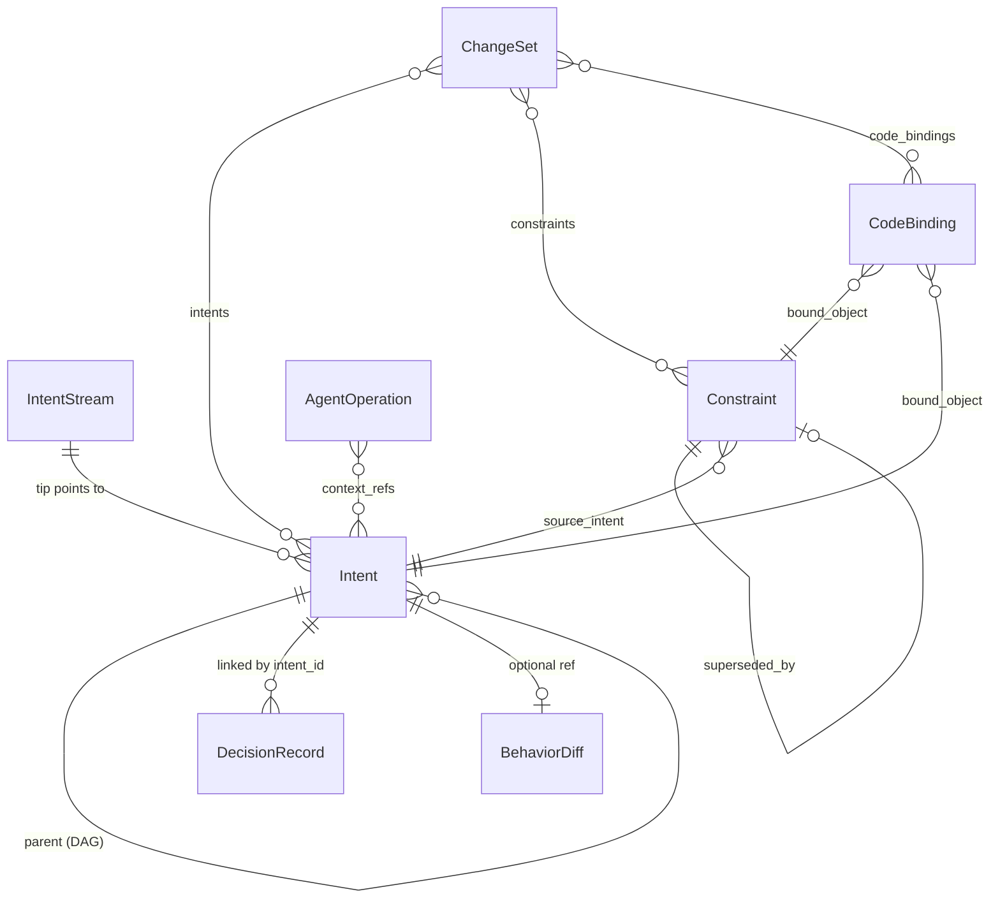

# Telos

**Agent-first intent and constraint tracking layer for Git.**


---

## Motivation

Git tracks **what changed** in code. But AI agents — and human developers — need to know **why**: what was intended, what constraints must be respected, what decisions were made and why. This context lives in commit messages, PR descriptions, Slack threads, and developer memory — all places that are unstructured, unsearchable, and invisible to agents starting a new session.

Telos captures intent, constraints, decisions, and code bindings in a structured, queryable, content-addressable store that sits alongside Git. It is designed primarily for AI agents (with human developer UX as a secondary concern), giving them persistent memory across sessions and structured access to the reasoning behind code.

## What is Telos?

Telos is a Git layer that tracks the *why* behind code changes:

| Git tracks | Telos tracks |
|------------|-------------|
| File diffs | **Intents** — what you set out to do |
| Commit messages | **Constraints** — rules that must/should/prefer be followed |
| Blame | **Decisions** — choices made, alternatives rejected, rationale |
| File paths | **Code Bindings** — which constraints apply to which code |
| — | **Agent Operations** — what AI agents did, why, and with what result |

Every object is content-addressed (SHA-256), immutable, and forms a DAG — the same architecture as Git, applied to development reasoning.

## Why Telos over flat files?

A `CONSTRAINTS.md` or ADR directory captures the same *information*. Telos's advantage is **queryability**:

```bash
# Flat file: grep and hope
grep -r "authentication" docs/decisions/

# Telos: structured, scoped queries
telos query constraints --file src/auth/mod.rs       # What constraints apply to this file?
telos query constraints --symbol validate_token       # What about this function?
telos query constraints --impact security --json      # All active security constraints, machine-readable
telos query agent-ops --agent claude-review           # What did this agent do across sessions?
```

## Quick Start

### Build from source

```bash
git clone https://github.com/noahatfin/telos.git
cd telos
cargo build --release
# Binary: target/release/telos-cli
```

### Basic workflow

```bash
# Initialize
telos init

# Capture intent
telos intent \
  --statement "Add user authentication with JWT tokens" \
  --constraint "Sessions must expire after 24 hours" \
  --impact auth --impact security

# Create standalone constraints with lifecycle
telos constraint \
  --statement "All API endpoints must use HTTPS" \
  --severity must --impact security

# Record decisions
telos decide \
  --intent abc1234 \
  --question "Which JWT library?" \
  --decision "Use jsonwebtoken crate" \
  --rationale "Most popular, well-maintained" \
  --tag architecture

# Bind constraints to code
telos bind abc1234 --file src/auth/mod.rs --symbol validate_token --type function

# Query
telos context --impact auth --json          # Everything about auth
telos query constraints --file src/auth/mod.rs  # Constraints on this file
telos query agent-ops --agent claude-review     # Agent history

# Constraint lifecycle
telos supersede abc1234 --statement "Updated requirement" --reason "Policy change"
telos deprecate def5678 --reason "Feature removed"

# Validate
telos check --bindings    # Are code bindings still valid?
telos reindex             # Rebuild query indexes
```

## Core Concepts



| Object | Description |
|--------|-------------|
| **Intent** | A unit of developer purpose — statement, constraints, behavioral expectations, and impact tags. Forms a DAG via parent links. |
| **Constraint** | A first-class rule with lifecycle (Active → Superseded/Deprecated), severity (Must/Should/Prefer), and code scope. |
| **DecisionRecord** | An architectural decision linked to an intent — question, chosen option, rationale, and rejected alternatives. |
| **CodeBinding** | Links a Telos object to a code location (file, function, module, API, type). |
| **AgentOperation** | Logs what an AI agent did — operation type, result, files touched, context references. |
| **ChangeSet** | Bridges a Git commit to its Telos reasoning chain — intents, constraints, decisions, bindings, and agent ops. |
| **BehaviorDiff** | Describes behavioral changes introduced by an intent — impact radius and verification status. |
| **IntentStream** | A named branch of intents (analogous to a Git branch). |

## Architecture

```
┌──────────────────────────────────────────────────┐
│                    telos-cli                      │
│  init · intent · decide · log · show · query     │
│  context · stream · constraint · supersede       │
│  deprecate · bind · check · agent-log · reindex  │
├──────────────────────────────────────────────────┤
│                   telos-store                     │
│  ObjectDatabase · RefStore · IndexStore           │
│  Repository · Query · Lockfile                   │
├──────────────────────────────────────────────────┤
│                   telos-core                      │
│  Intent · Constraint · DecisionRecord            │
│  CodeBinding · AgentOperation · ChangeSet        │
│  BehaviorDiff · ObjectId (SHA-256)               │
└──────────────────────────────────────────────────┘
```

- **telos-core** — Domain types and content-addressable hashing. All objects are serialized to canonical JSON (sorted keys) and hashed with SHA-256.
- **telos-store** — Storage engine: content-addressable object database (fan-out directories), mutable ref store, JSON-based query indexes (impact, code path, symbol), lockfile-based atomic writes.
- **telos-cli** — Command-line interface (clap). All read commands support `--json` for agent consumption.

### `.telos/` directory layout

```
.telos/
├── HEAD                          # "ref: refs/streams/main"
├── config.json                   # Repository metadata
├── objects/                      # Content-addressable store
│   ├── a3/                       # Fan-out by first 2 hex chars
│   │   └── f29c...(62 chars)    # Object file (canonical JSON)
│   └── ...
├── indexes/                      # Query acceleration (rebuildable)
│   ├── impact.json              # impact_tag → [ObjectId]
│   ├── codepath.json            # file_path → [ObjectId]
│   └── symbols.json             # symbol_name → [ObjectId]
├── refs/
│   └── streams/
│       ├── main                  # Default stream
│       └── feature-auth          # User-created stream
└── logs/
    └── streams/                  # Stream operation logs
```

## CLI Reference

### Core commands

| Command | Synopsis | Description |
|---------|----------|-------------|
| `init` | `telos init` | Initialize a `.telos/` repository |
| `intent` | `telos intent -s <statement> [--constraint ...] [--impact ...] [--behavior ...]` | Create a new intent |
| `decide` | `telos decide --intent <id> --question <q> --decision <d> [--rationale ...] [--tag ...]` | Record a decision |
| `log` | `telos log [-n <count>] [--json]` | Show intent history |
| `show` | `telos show <id> [--json]` | Display any object by ID or prefix |

### Constraint lifecycle

| Command | Synopsis | Description |
|---------|----------|-------------|
| `constraint` | `telos constraint -s <statement> --severity <must\|should\|prefer> [--impact ...]` | Create a standalone constraint |
| `supersede` | `telos supersede <id> -s <new_statement> [--reason ...]` | Replace a constraint with a new version |
| `deprecate` | `telos deprecate <id> --reason <reason>` | Deprecate a constraint |

### Code bindings

| Command | Synopsis | Description |
|---------|----------|-------------|
| `bind` | `telos bind <object_id> --file <path> [--symbol <name>] [--type <file\|function\|module\|api\|type>]` | Bind an object to a code location |
| `check` | `telos check --bindings` | Validate that code bindings still resolve |

### Queries

| Command | Synopsis | Description |
|---------|----------|-------------|
| `query intents` | `telos query intents [--impact <area>] [--constraint-contains <text>] [--json]` | Find intents |
| `query decisions` | `telos query decisions [--intent <id>] [--tag <tag>] [--json]` | Find decisions |
| `query constraints` | `telos query constraints [--file <path>] [--symbol <name>] [--impact <area>] [--status <active\|superseded\|deprecated>] [--json]` | Find constraints (code-aware) |
| `query agent-ops` | `telos query agent-ops [--agent <id>] [--session <id>] [--json]` | Find agent operations |
| `context` | `telos context --impact <area> [--json]` | Aggregate intents + decisions for an impact area |

### Agent operations

| Command | Synopsis | Description |
|---------|----------|-------------|
| `agent-log` | `telos agent-log --agent <id> --session <id> --operation <type> --summary <text> [--file ...] [--context-ref ...]` | Log an agent operation |

### Maintenance

| Command | Synopsis | Description |
|---------|----------|-------------|
| `reindex` | `telos reindex` | Rebuild all query indexes from the object store |
| `stream` | `telos stream create\|list\|switch\|delete <name>` | Manage intent streams |

## For AI Agents

Telos is built agent-first. Every read command supports `--json`:

```bash
# Recover context at session start
telos context --impact auth --json

# Check constraints before modifying code
telos query constraints --file src/auth/mod.rs --json

# Log what you did
telos agent-log \
  --agent claude-review --session sess-042 \
  --operation review \
  --summary "Reviewed auth module for token expiry compliance" \
  --file src/auth/token.rs
```

**Agent workflow:**

1. **Context recovery** — `telos context --impact <area> --json` at session start
2. **Constraint checking** — `telos query constraints --file <path> --json` before modifications
3. **Decision logging** — `telos decide` after architectural choices
4. **Operation logging** — `telos agent-log` to build persistent session history

## Testing

```bash
cargo test
```

76 tests across 3 crates:

| Crate | Unit Tests | Integration Tests |
|-------|-----------|-------------------|
| telos-core | 20 | — |
| telos-store | 25 | — |
| telos-cli | — | 31 |

## Roadmap

- **Phase 1** (complete): Core data model, content-addressable storage, CLI, query system, `--json` output, `context` command
- **Phase 2** (complete): Constraint lifecycle (supersede/deprecate), code bindings, agent operation logging, IndexStore, code-aware queries
- **Phase 3** (planned): Agent memory SDK (`telos-agent` crate), semantic search, embedding store
- **Phase 4** (planned): Deep Git integration (hooks, commit metadata), code graph (`telos-codegraph` with tree-sitter)

See [docs/TELOS_V2_DESIGN.md](docs/TELOS_V2_DESIGN.md) for the full v2 design document.

## Contributing

1. Fork the repository
2. Create a feature branch: `git checkout -b my-feature`
3. Make your changes
4. Run checks:
   ```bash
   cargo fmt --check
   cargo clippy -- -D warnings
   cargo test
   ```
5. Submit a pull request

## License

[MIT](LICENSE)
