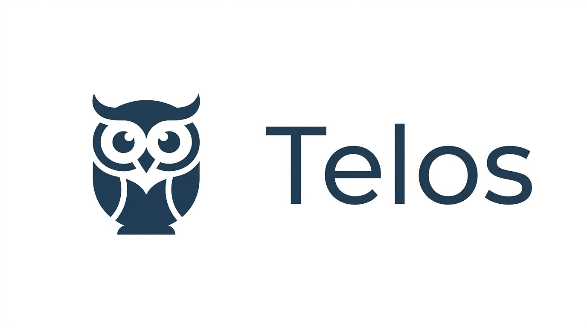
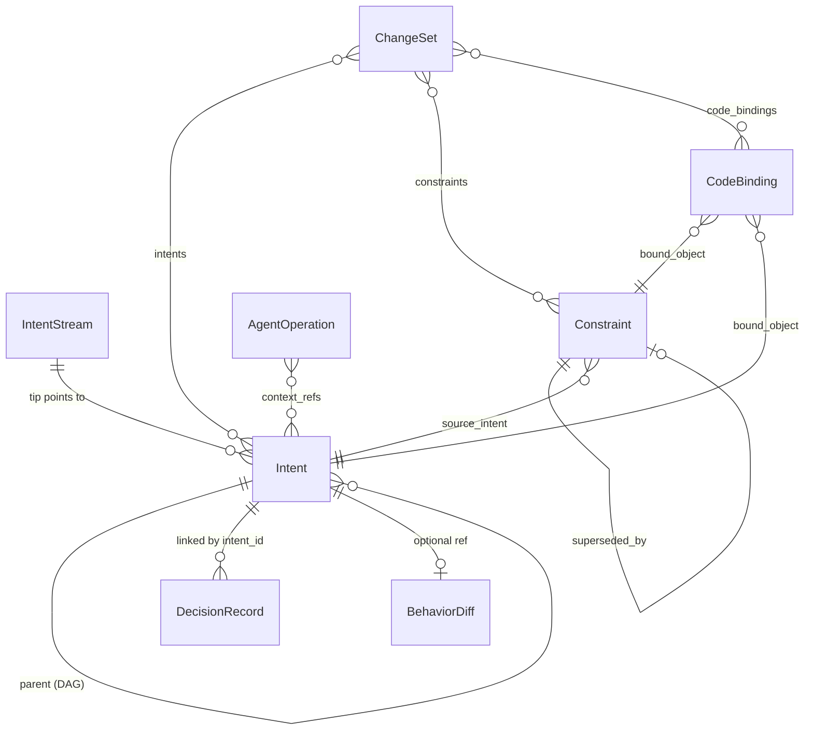
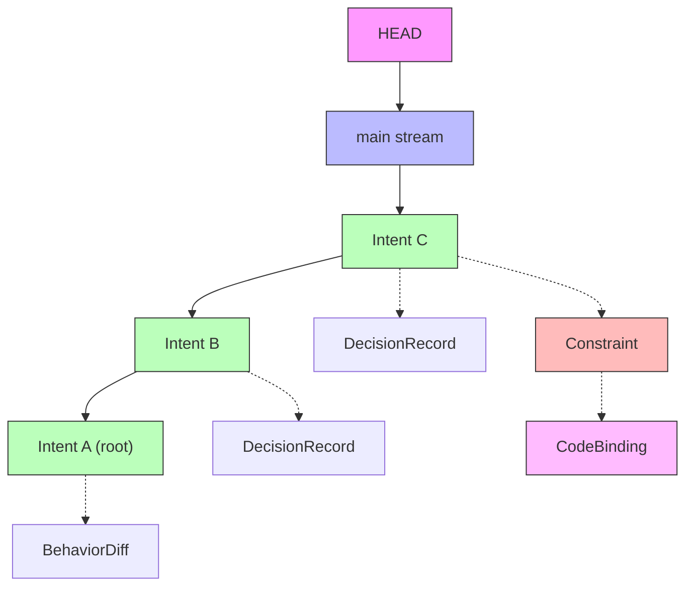

<p align="center">
  
</p>

<p align="center">
  <strong>Agent-first intent and constraint tracking layer for Git.</strong>
</p>

<p align="center">
  <a href="#quick-start">Quick Start</a> &nbsp;&middot;&nbsp;
  <a href="#core-concepts">Core Concepts</a> &nbsp;&middot;&nbsp;
  <a href="#cli-reference">CLI Reference</a> &nbsp;&middot;&nbsp;
  <a href="#for-ai-agents">For AI Agents</a> &nbsp;&middot;&nbsp;
  <a href="docs/TELOS_V2_DESIGN.md">Design Doc</a>
</p>

<p align="center">
  
  
  
  
</p>

---

## Motivation

Git tracks **what changed** in code. But AI agents — and human developers — need to know **why**: what was intended, what constraints must be respected, what decisions were made and why.

This context lives in commit messages, PR descriptions, Slack threads, and developer memory — all unstructured, unsearchable, and invisible to agents starting a new session.

> **Telos captures intent, constraints, decisions, and code bindings in a structured, queryable, content-addressable store that sits alongside Git — giving AI agents persistent memory across sessions.**

---

## What is Telos?

<table>
<tr>
<th width="50%">Git tracks</th>
<th width="50%">Telos tracks</th>
</tr>
<tr>
<td>File diffs</td>
<td><strong>Intents</strong> — what you set out to do</td>
</tr>
<tr>
<td>Commit messages</td>
<td><strong>Constraints</strong> — rules that must/should/prefer be followed</td>
</tr>
<tr>
<td>Blame</td>
<td><strong>Decisions</strong> — choices made, alternatives rejected, rationale</td>
</tr>
<tr>
<td>File paths</td>
<td><strong>Code Bindings</strong> — which constraints apply to which code</td>
</tr>
<tr>
<td>—</td>
<td><strong>Agent Operations</strong> — what AI agents did, why, and with what result</td>
</tr>
</table>

Every object is content-addressed (SHA-256), immutable, and forms a DAG — the same architecture as Git, applied to development reasoning.

---

## Why Telos over flat files?

A `CONSTRAINTS.md` or ADR directory captures the same *information*. Telos's advantage is **queryability**:

```bash
# Flat file: grep and hope
grep -r "authentication" docs/decisions/

# Telos: structured, scoped queries
telos query constraints --file src/auth/mod.rs       # What constraints apply to this file?
telos query constraints --symbol validate_token       # What about this function?
telos query constraints --impact security --json      # All active security constraints
telos query agent-ops --agent claude-review           # What did this agent do?
```

---

## Quick Start

### Build from source

```bash
git clone https://github.com/noahatfin/telos.git
cd telos
cargo build --release
# Binary: target/release/telos-cli
```

> **Prerequisites:** [Rust toolchain](https://rustup.rs/) 1.70+

### Basic workflow

```bash
# 1. Initialize
telos init

# 2. Capture intent
telos intent \
  --statement "Add user authentication with JWT tokens" \
  --constraint "Sessions must expire after 24 hours" \
  --impact auth --impact security

# 3. Create standalone constraints with lifecycle
telos constraint \
  --statement "All API endpoints must use HTTPS" \
  --severity must --impact security

# 4. Record decisions
telos decide \
  --intent abc1234 \
  --question "Which JWT library?" \
  --decision "Use jsonwebtoken crate" \
  --rationale "Most popular, well-maintained" \
  --tag architecture

# 5. Bind constraints to code
telos bind abc1234 --file src/auth/mod.rs --symbol validate_token --type function

# 6. Query
telos context --impact auth --json              # Everything about auth
telos query constraints --file src/auth/mod.rs  # Constraints on this file
telos query agent-ops --agent claude-review     # Agent history

# 7. Constraint lifecycle
telos supersede abc1234 --statement "Updated requirement" --reason "Policy change"
telos deprecate def5678 --reason "Feature removed"

# 8. Validate & maintain
telos check --bindings    # Are code bindings still valid?
telos reindex             # Rebuild query indexes
```

---

## Core Concepts



<table>
<tr><th>Object</th><th>Description</th></tr>
<tr>
<td><strong>Intent</strong></td>
<td>A unit of developer purpose — statement, constraints, behavioral expectations, and impact tags. Forms a DAG via parent links.</td>
</tr>
<tr>
<td><strong>Constraint</strong></td>
<td>A first-class rule with lifecycle (<code>Active → Superseded / Deprecated</code>), severity (<code>Must / Should / Prefer</code>), and code scope.</td>
</tr>
<tr>
<td><strong>DecisionRecord</strong></td>
<td>An architectural decision linked to an intent — question, chosen option, rationale, and rejected alternatives.</td>
</tr>
<tr>
<td><strong>CodeBinding</strong></td>
<td>Links a Telos object to a code location — file, function, module, API, or type.</td>
</tr>
<tr>
<td><strong>AgentOperation</strong></td>
<td>Logs what an AI agent did — operation type, result, files touched, context references.</td>
</tr>
<tr>
<td><strong>ChangeSet</strong></td>
<td>Bridges a Git commit to its Telos reasoning chain — intents, constraints, decisions, bindings, and agent ops.</td>
</tr>
<tr>
<td><strong>BehaviorDiff</strong></td>
<td>Describes behavioral changes introduced by an intent — impact radius and verification status.</td>
</tr>
<tr>
<td><strong>IntentStream</strong></td>
<td>A named branch of intents (analogous to a Git branch).</td>
</tr>
</table>

---

## Architecture

```
                    ┌──────────────────────────────────────────────────┐
                    │                    telos-cli                      │
                    │  init · intent · decide · log · show · query     │
                    │  context · stream · constraint · supersede       │
                    │  deprecate · bind · check · agent-log · reindex  │
                    ├──────────────────────────────────────────────────┤
                    │                   telos-store                     │
                    │  ObjectDatabase · RefStore · IndexStore           │
                    │  Repository · Query · Lockfile                   │
                    ├──────────────────────────────────────────────────┤
                    │                   telos-core                      │
                    │  Intent · Constraint · DecisionRecord            │
                    │  CodeBinding · AgentOperation · ChangeSet        │
                    │  BehaviorDiff · ObjectId (SHA-256)               │
                    └──────────────────────────────────────────────────┘
```

| Crate | Role |
|-------|------|
| **telos-core** | Domain types and content-addressable hashing. Canonical JSON + SHA-256. |
| **telos-store** | Storage engine: fan-out object database, ref store, JSON query indexes, lockfile-based atomic writes. |
| **telos-cli** | Command-line interface (clap). All read commands support `--json` for agent consumption. |

<details>
<summary><strong><code>.telos/</code> directory layout</strong></summary>

```
.telos/
├── HEAD                          # "ref: refs/streams/main"
├── config.json                   # Repository metadata
├── objects/                      # Content-addressable store
│   ├── a3/                       # Fan-out by first 2 hex chars
│   │   └── f29c...(62 chars)    # Object file (canonical JSON)
│   └── ...
├── indexes/                      # Query acceleration (rebuildable)
│   ├── impact.json              # impact_tag → [ObjectId]
│   ├── codepath.json            # file_path → [ObjectId]
│   └── symbols.json             # symbol_name → [ObjectId]
├── refs/
│   └── streams/
│       ├── main                  # Default stream
│       └── feature-auth          # User-created stream
└── logs/
    └── streams/                  # Stream operation logs
```

</details>

---

## CLI Reference

<details open>
<summary><strong>Core commands</strong></summary>

| Command | Synopsis | Description |
|---------|----------|-------------|
| `init` | `telos init` | Initialize a `.telos/` repository |
| `intent` | `telos intent -s <statement> [--constraint ...] [--impact ...] [--behavior ...]` | Create a new intent |
| `decide` | `telos decide --intent <id> --question <q> --decision <d> [--rationale ...] [--tag ...]` | Record a decision |
| `log` | `telos log [-n <count>] [--json]` | Show intent history |
| `show` | `telos show <id> [--json]` | Display any object by ID or prefix |

</details>

<details>
<summary><strong>Constraint lifecycle</strong></summary>

| Command | Synopsis | Description |
|---------|----------|-------------|
| `constraint` | `telos constraint -s <statement> --severity <must\|should\|prefer> [--impact ...]` | Create a standalone constraint |
| `supersede` | `telos supersede <id> -s <new_statement> [--reason ...]` | Replace a constraint with a new version |
| `deprecate` | `telos deprecate <id> --reason <reason>` | Deprecate a constraint |

</details>

<details>
<summary><strong>Code bindings</strong></summary>

| Command | Synopsis | Description |
|---------|----------|-------------|
| `bind` | `telos bind <object_id> --file <path> [--symbol <name>] [--type file\|function\|module\|api\|type]` | Bind an object to a code location |
| `check` | `telos check --bindings` | Validate that code bindings still resolve |

</details>

<details>
<summary><strong>Queries</strong></summary>

| Command | Synopsis | Description |
|---------|----------|-------------|
| `query intents` | `telos query intents [--impact <area>] [--constraint-contains <text>] [--json]` | Find intents |
| `query decisions` | `telos query decisions [--intent <id>] [--tag <tag>] [--json]` | Find decisions |
| `query constraints` | `telos query constraints [--file <path>] [--symbol <name>] [--impact <area>] [--status active\|superseded\|deprecated] [--json]` | Find constraints (code-aware) |
| `query agent-ops` | `telos query agent-ops [--agent <id>] [--session <id>] [--json]` | Find agent operations |
| `context` | `telos context --impact <area> [--json]` | Aggregate intents + decisions for an impact area |

</details>

<details>
<summary><strong>Agent operations</strong></summary>

| Command | Synopsis | Description |
|---------|----------|-------------|
| `agent-log` | `telos agent-log --agent <id> --session <id> --operation <type> --summary <text> [--file ...] [--context-ref ...]` | Log an agent operation |

</details>

<details>
<summary><strong>Maintenance</strong></summary>

| Command | Synopsis | Description |
|---------|----------|-------------|
| `reindex` | `telos reindex` | Rebuild all query indexes from the object store |
| `stream` | `telos stream create\|list\|switch\|delete <name>` | Manage intent streams |

</details>

---

## For AI Agents

Telos is built **agent-first**. Every read command supports `--json`:

```bash
# Recover context at session start
telos context --impact auth --json

# Check constraints before modifying code
telos query constraints --file src/auth/mod.rs --json

# Log what you did
telos agent-log \
  --agent claude-review --session sess-042 \
  --operation review \
  --summary "Reviewed auth module for token expiry compliance" \
  --file src/auth/token.rs
```

**Recommended agent workflow:**

```
┌─────────────────┐     ┌─────────────────┐     ┌─────────────────┐     ┌─────────────────┐
│  1. RECOVER      │────▶│  2. CHECK        │────▶│  3. WORK         │────▶│  4. LOG          │
│                 │     │                 │     │                 │     │                 │
│  telos context  │     │  telos query    │     │  (write code)  │     │  telos decide   │
│  --impact auth  │     │  constraints    │     │                 │     │  telos agent-log│
│  --json         │     │  --file <path>  │     │                 │     │                 │
└─────────────────┘     └─────────────────┘     └─────────────────┘     └─────────────────┘
```

---

## Storage Model



All objects are stored in a **content-addressable database**:

- Serialized to canonical JSON (sorted keys) and hashed with **SHA-256**
- Stored with **fan-out**: `objects/a3/f29c...` (2-char prefix + 62-char filename)
- **Immutable** — once written, objects never change
- **Atomic** writes via lockfile mechanism
- Prefix-addressable (minimum 4 characters, auto-disambiguated)

---

## Testing

```bash
cargo test
```

**76 tests** across 3 crates:

| Crate | Tests | Coverage |
|-------|-------|----------|
| telos-core | 20 unit | Object serialization, round-trips, hashing |
| telos-store | 25 unit | ODB, refs, indexes, queries, repository |
| telos-cli | 31 integration | Full CLI workflows, all commands |

---

## Roadmap

| Phase | Status | Scope |
|-------|--------|-------|
| **Phase 1** | Complete | Core data model, content-addressable storage, CLI, query system, `--json`, `context` |
| **Phase 2** | Complete | Constraint lifecycle, code bindings, agent operation logging, IndexStore, code-aware queries |
| **Phase 3** | Planned | Agent memory SDK (`telos-agent`), semantic search, embedding store |
| **Phase 4** | Planned | Deep Git integration (hooks, commit metadata), code graph (`telos-codegraph` + tree-sitter) |

See [docs/TELOS_V2_DESIGN.md](docs/TELOS_V2_DESIGN.md) for the full v2 design document.

---

## Contributing

1. Fork the repository
2. Create a feature branch: `git checkout -b my-feature`
3. Run checks:
   ```bash
   cargo fmt --check
   cargo clippy -- -D warnings
   cargo test
   ```
4. Submit a pull request

## License

[MIT](LICENSE)
