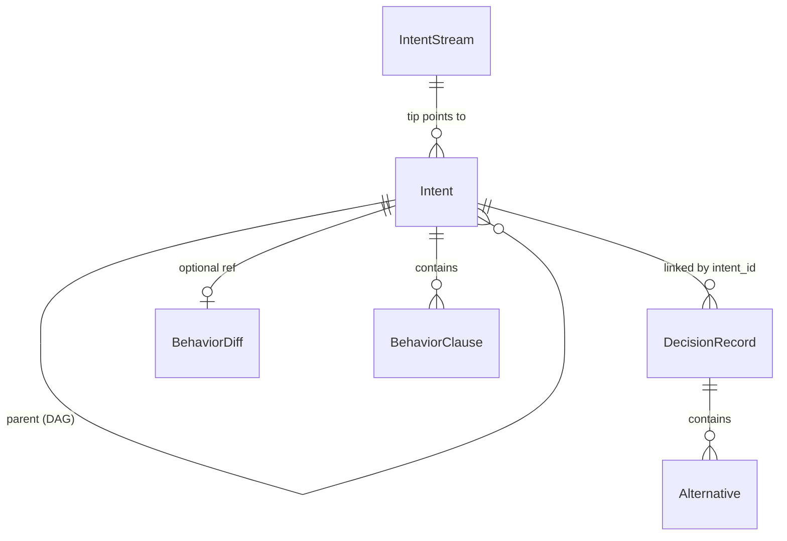
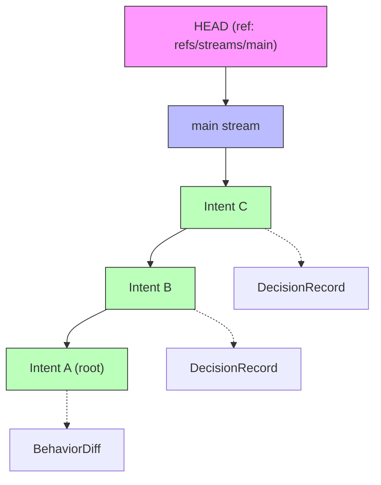

# Telos

**Intent-native development tracking for humans and AI agents.**


---

## Motivation

Git, pull requests, code review — the entire development tool ecosystem was designed in an era when human developers were the primary readers and reviewers of code. These tools are optimized for tracking textual diffs: what lines changed, in what files, with what commit message attached. And for decades, that was enough.

The landscape is shifting. AI agents now write, review, and debug code alongside humans. But unlike a team member who carries institutional knowledge from one meeting to the next, an agent starts each session from scratch. It has no memory of why the authentication module uses short-lived tokens, no awareness that a past architectural decision explicitly rejected the approach it's about to suggest, no sense of which constraints are sacred and which are flexible. Git history can tell it *what* changed — but recovering *why* from commit messages and diffs is like reconstructing a conversation from its punctuation.

We need a complementary framework built around **context**, not code. One that captures intent, constraints, decisions, and impact relationships in a structured, queryable format — so that any agent (or human) arriving at the codebase can immediately understand not just the current state, but the reasoning that produced it.

Telos experiments with this idea. It borrows Git's proven architecture — content-addressable objects, DAGs, branches — but applies it to development intent rather than source code. The result is a layer that sits alongside Git and makes the *why* as accessible as the *what*.

## What is Telos?

Telos is a structured intent and decision tracking layer that works alongside Git. It doesn't replace Git — it captures the *why* behind code changes in a queryable, machine-readable format.

Git tracks **what changed** in your code. Telos tracks **what you intended**, **what constraints you set**, and **what decisions you made and why**. Every intent, decision, and behavioral expectation is stored as a content-addressable object (SHA-256), forming a DAG that mirrors your development history.

Telos is designed for both human developers and AI agents. Its `--json` output mode and `context` command make it a natural integration point for LLM-powered coding assistants that need to recover project context across sessions.

## Why Telos?

| Scenario | Git only | Git + Telos |
|----------|----------|-------------|
| **Cross-session context recovery** | Re-read commit messages, grep through code | `telos context --impact auth` — get all intents, constraints, and decisions for a domain |
| **Debugging with constraints** | Hope someone documented invariants | `telos query intents --constraint-contains "must not"` — find all safety constraints |
| **Code review / constraint guarding** | Reviewer must remember all prior decisions | `telos query decisions --tag architecture` — surface relevant past decisions |
| **Impact-scoped refactoring** | Manual grep for affected areas | `telos query intents --impact payments` — find everything that touches a subsystem |

## Quick Start

### Prerequisites

- [Rust toolchain](https://rustup.rs/) (1.70+)

### Build from source

```bash
git clone https://github.com/noahatfin/telos.git
cd telos
cargo build --release
```

The binary is at `target/release/telos-cli`.

### Initialize a repository

```bash
telos init
```

This creates a `.telos/` directory in the current folder.

### Create your first intent

```bash
telos intent \
  --statement "Add user authentication with JWT tokens" \
  --constraint "Sessions must expire after 24 hours" \
  --constraint "Passwords must be hashed with bcrypt" \
  --impact auth \
  --impact security \
  --behavior "GIVEN a valid login|WHEN credentials are submitted|THEN a JWT token is returned"
```

### Record a decision

```bash
telos decide \
  --intent abc1234 \
  --question "Which JWT library should we use?" \
  --decision "Use jsonwebtoken crate" \
  --rationale "Most popular, well-maintained, supports RS256" \
  --alternative "frank_jwt|Fewer downloads, less active maintenance" \
  --tag architecture \
  --tag dependency
```

### Query context

```bash
# Show all intents and decisions for an impact area
telos context --impact auth

# Find intents with specific constraints
telos query intents --constraint-contains "must not"

# Find decisions by tag
telos query decisions --tag architecture
```

## Core Concepts



| Object | Description |
|--------|-------------|
| **Intent** | A unit of developer purpose — statement, constraints, behavioral expectations, and impact tags. Intents form a DAG via parent links. |
| **DecisionRecord** | An architectural or implementation decision linked to an intent — captures the question, chosen option, rationale, and rejected alternatives. |
| **BehaviorDiff** | A description of behavioral changes introduced by an intent — what changed, impact radius, and verification status. |
| **IntentStream** | A named branch of intents (analogous to a Git branch). HEAD points to the current stream, which points to its tip intent. |

## Architecture

```
┌─────────────────────────────────────────────┐
│                  telos-cli                   │
│  init · intent · decide · log · show        │
│  query · context · stream                   │
├─────────────────────────────────────────────┤
│                 telos-store                  │
│  ObjectDatabase · RefStore · Repository     │
│  Query · Lockfile                           │
├─────────────────────────────────────────────┤
│                 telos-core                   │
│  Intent · DecisionRecord · BehaviorDiff     │
│  ObjectId (SHA-256) · Canonical Serialization│
└─────────────────────────────────────────────┘
```

Telos uses a three-crate layered architecture:

- **telos-core** — Domain types and content-addressable hashing. All objects are serialized to canonical JSON (sorted keys, no trailing whitespace) and hashed with SHA-256 to produce deterministic `ObjectId`s.
- **telos-store** — Storage engine. Content-addressable object database with fan-out directories, mutable ref store for HEAD and stream pointers, query index, and lockfile-based atomic writes.
- **telos-cli** — Command-line interface built with clap. Supports both human-readable and `--json` output.

### `.telos/` directory layout

```
.telos/
├── HEAD                          # "ref: refs/streams/main"
├── config.json                   # Repository metadata
├── objects/                      # Content-addressable store
│   ├── a3/                       # Fan-out by first 2 hex chars
│   │   └── f29c...(62 chars)    # Object file (canonical JSON)
│   └── ...
└── refs/
    └── streams/
        ├── main                  # Default stream
        └── feature-auth          # User-created stream
```

## CLI Reference

| Command | Synopsis | Description |
|---------|----------|-------------|
| `init` | `telos init` | Initialize a `.telos/` repository in the current directory |
| `intent` | `telos intent -s <statement> [--constraint ...] [--impact ...] [--behavior ...]` | Create a new intent on the current stream |
| `decide` | `telos decide --intent <id> --question <q> --decision <d> [--rationale ...] [--alternative ...] [--tag ...]` | Record a decision linked to an intent |
| `log` | `telos log [-n <count>] [--json]` | Show intent history (most recent first) |
| `show` | `telos show <id> [--json]` | Display any object by ID or prefix (minimum 4 chars) |
| `query intents` | `telos query intents [--impact <area>] [--constraint-contains <text>] [--json]` | Find intents by impact area or constraint text |
| `query decisions` | `telos query decisions [--intent <id>] [--tag <tag>] [--json]` | Find decisions by intent or tag |
| `context` | `telos context --impact <area> [--json]` | Aggregate intents and linked decisions for an impact area |
| `stream create` | `telos stream create <name>` | Create a new intent stream |
| `stream list` | `telos stream list` | List all streams (current stream marked with `*`) |
| `stream switch` | `telos stream switch <name>` | Switch HEAD to a different stream |
| `stream delete` | `telos stream delete <name>` | Delete a stream (cannot delete the current stream) |

## For AI Agents

Telos is built to be consumed by LLM coding assistants. Every read command supports `--json` for structured output:

```bash
telos context --impact auth --json
```

```json
{
  "impact": "auth",
  "intents": [
    {
      "intent_id": "a3f29c...",
      "intent": {
        "author": { "name": "Alice", "email": "alice@example.com" },
        "statement": "Add user authentication with JWT tokens",
        "constraints": ["Sessions must expire after 24 hours"],
        "impacts": ["auth", "security"],
        "behavior_spec": [
          { "given": "a valid login", "when": "credentials are submitted", "then": "a JWT token is returned" }
        ]
      },
      "decisions": [
        {
          "decision_id": "b7e41d...",
          "decision": {
            "question": "Which JWT library should we use?",
            "decision": "Use jsonwebtoken crate",
            "rationale": "Most popular, well-maintained, supports RS256",
            "tags": ["architecture", "dependency"]
          }
        }
      ]
    }
  ]
}
```

**How agents use Telos:**

1. **Context recovery** — At the start of a session, run `telos context --impact <area> --json` to load relevant intents, constraints, and past decisions.
2. **Constraint checking** — Before making changes, query `telos query intents --constraint-contains <keyword> --json` to find constraints that must be respected.
3. **Decision logging** — After making an architectural choice, record it with `telos decide` so future sessions (human or AI) can recover the rationale.

## Storage Model



All objects are stored in a **content-addressable database**:

- Each object is serialized to canonical JSON and hashed with SHA-256
- Objects are stored using a **fan-out** scheme: `objects/a3/f29c...` (2-char prefix directory + 62-char filename)
- Objects are **immutable** — once written, they never change
- Writes are **atomic** — a lockfile mechanism ensures no partial writes on crash
- Object IDs can be referenced by prefix (minimum 4 characters), automatically disambiguated

## Testing

```bash
cargo test
```

59 tests across 3 crates:

| Crate | Unit Tests | Integration Tests |
|-------|-----------|-------------------|
| telos-core | 16 | — |
| telos-store | 22 | — |
| telos-cli | — | 21 |

## Evaluation

Telos includes a validation framework with 4 controlled experiments comparing a Git-only agent against a Telos+Git agent across context recovery, debugging, code review, and refactoring tasks. See [docs/EVALUATION.md](docs/EVALUATION.md) for the full methodology, scoring rubric, and results.

## Roadmap

- **Phase 1** (complete): Core data model, content-addressable storage engine, CLI, query system, `--json` output, `context` command
- **Phase 2** (planned): Behavior verification, conflict detection between streams, constraint validation
- **Phase 3** (planned): Git integration, pre-commit hooks, IDE extensions

## Contributing

1. Fork the repository
2. Create a feature branch: `git checkout -b my-feature`
3. Make your changes
4. Run checks:
   ```bash
   cargo fmt --check
   cargo clippy -- -D warnings
   cargo test
   ```
5. Submit a pull request

## License

[MIT](LICENSE)
