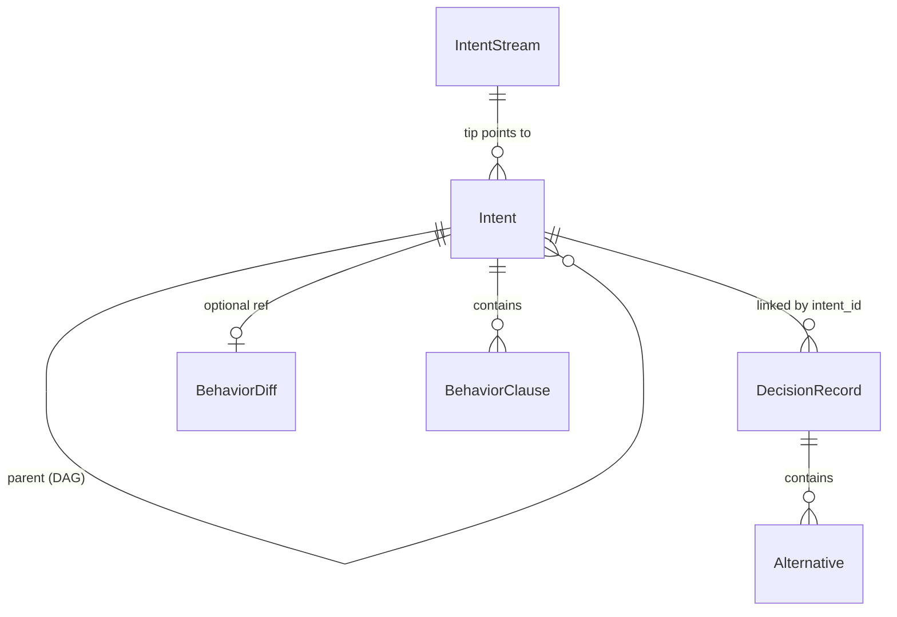

# Telos Project Evaluation

## 1. Executive Summary

Telos is an intent-native development tracking layer that works alongside Git. While Git tracks *what changed* in source code, Telos captures *why* — the intents, constraints, decisions, and behavioral expectations behind changes — in a structured, queryable, content-addressable format.

This document defines the evaluation methodology for validating Telos's core hypothesis: **AI agents equipped with structured intent context make better decisions than agents working with Git history alone.** Four controlled experiments compare a Git-only agent against a Telos+Git agent across context recovery, debugging, code review, and refactoring tasks. Results are pending.

## 2. Project Overview

### 2.1 Problem Statement

Modern development tooling — Git, pull requests, code review — was designed when humans were the primary consumers of code history. These tools optimize for tracking textual diffs and linear commit narratives. AI agents, which increasingly write, review, and debug code, start each session without institutional memory. Git history alone cannot efficiently convey *why* decisions were made, *what constraints* must be upheld, or *how* changes impact other subsystems.

Telos addresses this gap by providing a complementary tracking layer that captures development intent in a machine-readable, queryable format.

### 2.2 Architecture

Telos uses a three-crate layered architecture:

```
┌─────────────────────────────────────────────┐
│                  telos-cli                   │
│  init · intent · decide · log · show        │
│  query · context · stream                   │
├─────────────────────────────────────────────┤
│                 telos-store                  │
│  ObjectDatabase · RefStore · Repository     │
│  Query · Lockfile                           │
├─────────────────────────────────────────────┤
│                 telos-core                   │
│  Intent · DecisionRecord · BehaviorDiff     │
│  ObjectId (SHA-256) · Canonical Serialization│
└─────────────────────────────────────────────┘
```

- **telos-core** — Domain types and content-addressable hashing. All objects are serialized to canonical JSON (sorted keys, no trailing whitespace) and hashed with SHA-256 to produce deterministic `ObjectId`s.
- **telos-store** — Storage engine. Content-addressable object database with fan-out directories, mutable ref store for HEAD and stream pointers, query index, and lockfile-based atomic writes.
- **telos-cli** — Command-line interface built with clap. Supports both human-readable and `--json` output for agent consumption.

### 2.3 Data Model



| Object | Key Fields | Description |
|--------|-----------|-------------|
| **Intent** | `statement`, `constraints[]`, `impacts[]`, `behavior_spec[]`, `parents[]` | A unit of developer purpose. Intents form a DAG via parent links. Each captures a statement of intent, constraints that must be upheld, impact tags for cross-cutting concerns, and optional behavioral expectations in Given/When/Then format. |
| **DecisionRecord** | `intent_id`, `question`, `decision`, `rationale`, `alternatives[]`, `tags[]` | An architectural or implementation decision linked to an intent. Captures the question, chosen option, rationale, and rejected alternatives with rejection reasons. |
| **BehaviorDiff** | `intent_id`, `changes[]`, `impact: {direct[], indirect[]}`, `verification` | Describes behavioral changes introduced by an intent — what changed, the impact radius (direct and indirect modules), and verification status (Pending/Passed/Failed). |
| **IntentStream** | `name`, `tip`, `description` | A named branch of intents analogous to a Git branch. HEAD points to the current stream, which points to its tip intent. |

All objects are immutable and content-addressed via SHA-256. The `TelosObject` enum wraps all four types with a `type` discriminator tag for serialization.

## 3. Test Coverage

### 3.1 Unit Tests — telos-core (16 tests)

Tests for content-addressable hashing and canonical serialization:

| File | Test | Purpose |
|------|------|---------|
| `hash.rs` | `hash_deterministic` | Same input produces same ObjectId |
| `hash.rs` | `hash_different_inputs` | Different inputs produce different ObjectIds |
| `hash.rs` | `parse_valid` | Valid hex string parses to ObjectId |
| `hash.rs` | `parse_invalid_length` | Rejects wrong-length hex strings |
| `hash.rs` | `parse_invalid_chars` | Rejects non-hex characters |
| `hash.rs` | `fan_out_split` | ObjectId splits into 2-char prefix + 62-char suffix |
| `hash.rs` | `display_short` | Short display truncates to prefix |
| `serialize.rs` | `canonical_serialize_sorted_keys` | JSON output has sorted keys |
| `serialize.rs` | `content_hash_deterministic` | Serialization + hashing is deterministic |
| `serialize.rs` | `different_type_tags_different_hash` | Different type tags produce different hashes |
| `serialize.rs` | `nested_objects_sorted` | Nested structures also have sorted keys |
| `serialize.rs` | `unicode_content` | Unicode content round-trips correctly |
| `object/mod.rs` | `round_trip_intent` | Intent serializes and deserializes losslessly |
| `object/mod.rs` | `content_id_deterministic` | Same Intent always produces same ObjectId |
| `object/mod.rs` | `type_tag_correct` | Serialized Intent has `"type": "intent"` tag |
| `object/mod.rs` | `round_trip_decision_record` | DecisionRecord round-trips losslessly |

### 3.2 Unit Tests — telos-store (22 tests)

Tests for the storage engine, ref management, query index, and locking:

| File | Test | Purpose |
|------|------|---------|
| `odb.rs` | `write_and_read` | Write object, read it back by ObjectId |
| `odb.rs` | `write_idempotent` | Writing same object twice is a no-op |
| `odb.rs` | `read_nonexistent` | Reading missing ObjectId returns error |
| `odb.rs` | `resolve_prefix` | Resolve object by 4+ char hex prefix |
| `odb.rs` | `iter_all_returns_all_objects` | Iterator yields all stored objects |
| `refs.rs` | `head_round_trip` | HEAD write/read round-trips |
| `refs.rs` | `stream_create_and_read` | Create stream ref and read it back |
| `refs.rs` | `stream_create_duplicate_fails` | Duplicate stream name returns error |
| `refs.rs` | `list_streams` | List all stream refs |
| `lockfile.rs` | `lock_write_commit` | Acquire lock, write, commit atomically |
| `lockfile.rs` | `lock_dropped_without_commit` | Dropping lock without commit cleans up |
| `lockfile.rs` | `double_lock_fails` | Second lock on same file fails |
| `repository.rs` | `init_and_open` | Initialize repo and reopen it |
| `repository.rs` | `init_twice_fails` | Double-init returns error |
| `repository.rs` | `discover_from_subdirectory` | Find `.telos/` from nested directory |
| `repository.rs` | `create_intent_and_read` | End-to-end: create intent, verify storage |
| `repository.rs` | `read_object_by_prefix` | Prefix-based object lookup via Repository |
| `repository.rs` | `walk_intent_dag` | Walk parent links in intent DAG |
| `query.rs` | `query_intents_by_impact` | Filter intents by impact tag |
| `query.rs` | `query_intents_by_constraint` | Filter intents by constraint substring |
| `query.rs` | `query_decisions_by_intent` | Find decisions linked to an intent |
| `query.rs` | `query_decisions_by_tag` | Filter decisions by tag |

### 3.3 Integration Tests — telos-cli (21 tests)

End-to-end CLI tests using `assert_cmd`:

| File | Test | Purpose |
|------|------|---------|
| `cli_test.rs` | `init_creates_telos_dir` | `telos init` creates `.telos/` directory |
| `cli_test.rs` | `init_twice_fails` | Double-init exits with error |
| `cli_test.rs` | `intent_on_empty_stream` | First intent on fresh stream succeeds |
| `cli_test.rs` | `intent_with_constraints_and_impacts` | Intent with `--constraint` and `--impact` flags |
| `cli_test.rs` | `log_empty_stream` | `telos log` on empty stream shows nothing |
| `cli_test.rs` | `log_shows_intents` | `telos log` displays intent history |
| `cli_test.rs` | `show_intent_by_prefix` | `telos show <prefix>` resolves and displays object |
| `cli_test.rs` | `stream_create_list_switch_delete` | Full stream lifecycle |
| `cli_test.rs` | `decide_records_decision` | `telos decide` creates linked DecisionRecord |
| `cli_test.rs` | `full_workflow` | End-to-end: init → intent → decide → log → show |
| `cli_test.rs` | `log_json_empty_stream` | `telos log --json` on empty stream |
| `cli_test.rs` | `log_json_outputs_valid_json` | `telos log --json` produces valid JSON |
| `cli_test.rs` | `show_json_outputs_valid_json` | `telos show --json` produces valid JSON |
| `cli_test.rs` | `query_intents_by_impact` | `telos query intents --impact` filters correctly |
| `cli_test.rs` | `query_intents_by_constraint` | `telos query intents --constraint-contains` works |
| `cli_test.rs` | `query_decisions_by_tag` | `telos query decisions --tag` filters correctly |
| `cli_test.rs` | `context_aggregates_intents_and_decisions` | `telos context --impact` aggregates correctly |
| `cli_test.rs` | `query_intents_no_results` | Query with no matches returns empty |
| `cli_test.rs` | `intent_with_behavior_spec` | `--behavior` flag creates BehaviorClause |
| `cli_test.rs` | `decide_with_alternatives_and_tags` | `--alternative` and `--tag` flags on decide |
| `cli_test.rs` | `context_no_results` | Context with no matches returns empty |

### 3.4 Summary

| Crate | Unit Tests | Integration Tests | Total |
|-------|-----------|-------------------|-------|
| telos-core | 16 | — | 16 |
| telos-store | 22 | — | 22 |
| telos-cli | — | 21 | 21 |
| **Total** | **38** | **21** | **59** |

## 4. Validation Framework

### 4.1 Methodology

Each experiment uses a **controlled comparison** between two agent configurations:

| Agent | Tools Available | Context Source |
|-------|----------------|----------------|
| **Git-only** | `git log`, `git diff`, `git blame`, `git grep` | Commit messages, diffs, file history |
| **Telos+Git** | All Git tools + `telos context`, `telos query` | Structured intents, constraints, decisions, behavior specs + Git history |

Both agents receive the same task prompt and work against the same codebase state. The comparison isolates the value added by structured intent context.

### 4.2 TaskBoard — The Target Application

The validation uses **TaskBoard**, a purpose-built task management API with three modules:

| Module | Responsibilities | Key Constraints |
|--------|-----------------|-----------------|
| **auth** | JWT authentication, token management, RBAC | Token expiry <= 1 hour; tokens include role; secret not hardcoded |
| **tasks** | Task CRUD, status transitions, validation | Tasks reference valid board_id; title <= 200 chars; forward-only status transitions |
| **boards** | Board management, cross-module queries | Cascade-delete requires confirmation; columns define valid statuses |

TaskBoard is designed with deliberate cross-module dependencies that exercise Telos's impact-tracking capabilities:
- **boards → tasks**: Board deletion must handle associated tasks (cascade/orphan)
- **auth → tasks**: RBAC permissions control task operations (Admin, Member, Viewer roles)
- **tasks → boards**: Task creation requires valid board_id reference

### 4.3 Scenario Pipeline

The validation environment is built through a 6-stage scenario pipeline, each stage adding intents, decisions, and code changes:

| Stage | Script | What It Creates |
|-------|--------|----------------|
| 1. Bootstrap | `01_bootstrap.sh` | Git repo + Telos repo; project skeleton with 3 modules; initial architectural intent |
| 2. Auth | `02_auth.sh` | 3 intents (JWT auth, error handling, RBAC) + 2 decisions (token format, expiry duration) + 2 commits |
| 3. Tasks | `03_tasks.sh` | 2 intents (CRUD validation, status transitions) + 1 decision (ID format) + 2 commits |
| 4. Boards | `04_boards.sh` | 2 intents (board management, cross-module queries) + 1 decision (cascade vs orphan) + 2 commits |
| 5. Regression | `05_regression.sh` | 2 deliberate regressions: token expiry violation (3600→86400) + missing board_id validation |
| 6. Refactor | `06_refactor.sh` | Intent to rename tasks→items (sets up refactoring experiment; does not execute refactor) |

After all stages, the environment contains **10 intents**, **4 decisions**, and **2 known regressions** for experiment use.

## 5. Experiment Design

### 5.1 Experiment A: Cross-Session Agent Memory

**Goal:** Measure how effectively agents recover project context when resuming work in a new session.

**Setup:**
- Agent is told: "You are resuming work on a TaskBoard API project. Recover the current state, constraints, and past decisions for the auth module."
- Git-only agent receives: `git log` + `git diff` output
- Telos+Git agent receives: `telos context --impact auth --json` + `git log` output

**Ground Truth:** 3 intents covering auth (JWT authentication, error handling, RBAC), 8 constraints, and 2 decisions with alternatives.

**Metrics:**

| Metric | Measurement | How |
|--------|-------------|-----|
| Completeness | 0–100% | Fraction of expected keywords for all 3 intents found in agent response (jwt, authentication, error handling, rbac, role) |
| Constraint Recall | 0–100% | Fraction of constraint keywords found (1 hour, 3600, token expir, role, rbac, secret, hardcoded, production) |
| Decision Recall | 0–100% | Fraction of decision keywords found (jwt, hs256, session cookie, 3600, 1 hour, expir) |
| Overall | 0–100% | Average of the three metrics above |

**Pass Criterion:** Telos+Git agent scores >= 30% higher on overall recall than Git-only agent.

### 5.2 Experiment B: Debugging with Intent Context

**Goal:** Test whether structured constraints help agents find root causes faster.

**Bug:** Users can create tasks pointing to non-existent boards. The `TaskStore::create()` method does not validate that `board_id` references an existing board.

**Setup:**
- Agent is told: "Users report they can create tasks with invalid board IDs. Find the root cause and suggest a fix."
- Git-only agent receives: `git log --grep=task` + file history
- Telos+Git agent receives: `telos query intents --impact tasks --json` output, which surfaces the constraint *"Task must reference a valid board_id"* and the behavior spec *"GIVEN CreateTaskRequest with non-existent board_id WHEN create called THEN return 400 Bad Request"*

**Metrics:**

| Metric | Type | Indicators |
|--------|------|-----------|
| Found root cause | Binary | "doesn't validate", "no validation", "missing validation", "board_id is not checked" |
| Suggested correct fix | Binary | "check board", "validate board", "verify board", "boardstore", "exists(board_id" |
| Referenced constraint | Binary | "must reference a valid board" or "valid board_id" or "constraint" |
| Referenced behavior spec | Binary | "400", "bad request", "given.*non-existent.*board", "behavior" |
| Commands to root cause | Count | Lower is better |

**Pass Criteria:**
- Both agents should find the root cause (it's a straightforward bug)
- Telos agent should additionally reference the constraint and/or behavior spec
- Telos agent should require fewer commands to reach root cause

### 5.3 Experiment C: Constraint Guardian Code Review — CRITICAL

**Goal:** Determine whether Telos constraints catch violations that commit messages alone cannot reveal.

**Scenario:** A commit changes `TOKEN_EXPIRY_SECS` from `3600` to `86400` (1 hour → 24 hours). The commit message says *"Increase token expiry for better user experience"* — which sounds reasonable in isolation.

**The violation:** The Telos intent for JWT authentication includes the constraint *"Token expiry must be <= 1 hour for security"*. The change to 86400 seconds (24 hours) directly violates this constraint.

**Setup:**
- Agent is asked: "Review this commit for correctness."
- Git-only agent receives: `git diff HEAD~1..HEAD` + commit message
- Telos+Git agent receives: `git diff` + `telos query intents --impact auth --json` + `telos query intents --impact security --json`

**Metrics:**

| Metric | Type | Indicators |
|--------|------|-----------|
| Caught violation | Binary | "violat", "constraint", "must be <= 1 hour", "exceeds", "1 hour limit", "too long" |
| Cited specific constraint | Binary | "1 hour" AND ("constraint" OR "must be") |
| Recommended rejection | Binary | "reject", "should not", "cannot approve", "do not merge", "block", "revert" |
| Identified security risk | Binary | "security", "risk", "vulnerability", "token lifetime" |

**Expected Outcomes:**

| Agent | Expected Result | Reasoning |
|-------|----------------|-----------|
| Git-only | **Misses violation** | Diff shows a constant change; commit message provides plausible justification; no constraint information available |
| Telos+Git | **Catches violation** | `telos query` surfaces the "<= 1 hour" constraint directly alongside the diff |

**Pass Criteria:**
- **Conclusive:** Git-only misses, Telos catches → Telos demonstrates clear value
- **Inconclusive:** Both catch → constraint was guessable from code context alone
- **Failed:** Neither catches → Telos failed its core value proposition

This is the **most important experiment** — it tests whether structured constraints prevent real violations that look reasonable to a naive reviewer.

### 5.4 Experiment D: Impact-Guided Refactoring

**Goal:** Test whether impact tags help agents scope refactoring across module boundaries.

**Task:** Rename the `tasks` module to `items` throughout the codebase.

**Setup:**
- Agent is told: "Rename the tasks module to items. Identify all files, references, and cross-module dependencies that need updating."
- Git-only agent receives: `grep -r task` output + file listing
- Telos+Git agent receives: `telos query intents --impact tasks --json` + `telos query intents --impact boards --json` + `telos context --impact tasks --json`

**Critical Cross-Module Dependencies** (what Telos surfaces):
- **boards → tasks**: Board deletion cascades to tasks; boards query tasks by board_id
- **auth → tasks**: RBAC defines task-specific permissions (Member can create/modify tasks, Viewer gets 403 on task creation)

**Metrics:**

| Metric | Type | Indicators |
|--------|------|-----------|
| Renamed directory | Binary | "rename src/tasks", "mv src/tasks", "items/mod.rs" |
| Updated main module | Binary | "mod items", "main.rs", "mod tasks → mod items" |
| Updated boards references | Binary | "boards", "board_id", "cascade", "cross-module" |
| Updated struct names | Binary | "TaskStore → ItemStore", "CreateTask → CreateItem" |
| Identified cross-module deps | Binary | "board" AND ("task" OR "item") AND ("cross" OR "depend" OR "reference" OR "impact") |
| Mentioned auth RBAC link | Binary | "rbac", "role", "permission", "auth.*task", "member.*task", "viewer" |
| Completeness score | 0–100% | Count of true metrics / 6 |

**Pass Criteria:** Telos agent scores higher on completeness, particularly on cross-module awareness and the auth RBAC → task permission link (which is unlikely to surface from grep alone).

## 6. Scoring Rubric

### 6.1 Per-Experiment Scoring

**Experiment A — Cross-Session Agent Memory**

| Metric | Git-only Score | Telos+Git Score | Delta |
|--------|---------------|-----------------|-------|
| Completeness | _pending_ | _pending_ | |
| Constraint Recall | _pending_ | _pending_ | |
| Decision Recall | _pending_ | _pending_ | |
| **Overall** | _pending_ | _pending_ | **>= 30%?** |

**Experiment B — Debugging with Intent Context**

| Metric | Git-only | Telos+Git |
|--------|----------|-----------|
| Found root cause | _pending_ | _pending_ |
| Suggested correct fix | _pending_ | _pending_ |
| Referenced constraint | _pending_ | _pending_ |
| Referenced behavior spec | _pending_ | _pending_ |
| Commands to root cause | _pending_ | _pending_ |

**Experiment C — Constraint Guardian Code Review (CRITICAL)**

| Metric | Git-only | Telos+Git |
|--------|----------|-----------|
| Caught violation | _pending_ | _pending_ |
| Cited specific constraint | _pending_ | _pending_ |
| Recommended rejection | _pending_ | _pending_ |
| Identified security risk | _pending_ | _pending_ |

**Experiment D — Impact-Guided Refactoring**

| Metric | Git-only | Telos+Git |
|--------|----------|-----------|
| Renamed directory | _pending_ | _pending_ |
| Updated main module | _pending_ | _pending_ |
| Updated boards references | _pending_ | _pending_ |
| Updated struct names | _pending_ | _pending_ |
| Cross-module awareness | _pending_ | _pending_ |
| Auth RBAC link | _pending_ | _pending_ |
| **Completeness** | _pending_ | _pending_ |

### 6.2 Overall Success Criteria

Telos demonstrates measurable advantage in **at least 2 of 4 experiments**:

| Experiment | Pass Condition | Weight |
|-----------|----------------|--------|
| A: Memory | Telos overall recall >= 30% higher | Standard |
| B: Debugging | Telos references constraint/behavior; fewer commands | Standard |
| C: Review | Git-only misses violation, Telos catches it | **Critical** |
| D: Refactor | Telos higher completeness, especially cross-module | Standard |

The project is considered validated if:
- **Strong pass:** >= 3 experiments pass, including Experiment C
- **Pass:** >= 2 experiments pass
- **Weak pass:** Experiment C passes alone (demonstrates core value proposition)
- **Fail:** < 2 experiments pass and Experiment C fails

## 7. Results

**Status: Pending**

Results will be populated after running the experiment suite against the TaskBoard validation environment.

### Results Template

```json
{
  "experiment_a_memory": {
    "git_only": {
      "completeness": null,
      "constraint_recall": null,
      "decision_recall": null,
      "overall": null,
      "tokens_used": null
    },
    "telos_git": {
      "completeness": null,
      "constraint_recall": null,
      "decision_recall": null,
      "overall": null,
      "tokens_used": null
    },
    "delta": null,
    "pass": null
  },
  "experiment_b_debugging": {
    "git_only": {
      "found_root_cause": null,
      "suggested_correct_fix": null,
      "referenced_constraint": null,
      "referenced_behavior_spec": null,
      "commands_to_root_cause": null
    },
    "telos_git": {
      "found_root_cause": null,
      "suggested_correct_fix": null,
      "referenced_constraint": null,
      "referenced_behavior_spec": null,
      "commands_to_root_cause": null
    },
    "pass": null
  },
  "experiment_c_review": {
    "git_only": {
      "caught_violation": null,
      "cited_specific_constraint": null,
      "recommended_rejection": null,
      "identified_security_risk": null
    },
    "telos_git": {
      "caught_violation": null,
      "cited_specific_constraint": null,
      "recommended_rejection": null,
      "identified_security_risk": null
    },
    "pass": null,
    "conclusion": null
  },
  "experiment_d_refactor": {
    "git_only": {
      "completeness_score": null,
      "identified_cross_module": null,
      "mentioned_auth_rbac_link": null
    },
    "telos_git": {
      "completeness_score": null,
      "identified_cross_module": null,
      "mentioned_auth_rbac_link": null
    },
    "pass": null
  },
  "summary": {
    "experiments_passed": null,
    "overall_verdict": null
  }
}
```

## 8. Limitations and Future Work

### Limitations

- **Single target application:** All experiments use TaskBoard. Results may not generalize to larger or more complex codebases.
- **Simulated agents:** Experiments use generated context rather than live LLM sessions. Real agent behavior may differ.
- **Keyword-based scoring:** Metrics rely on keyword detection in agent responses, which may miss semantically correct answers phrased differently or credit superficial keyword matches.
- **No longitudinal data:** The evaluation captures a single point-in-time comparison. Long-term benefits of intent accumulation are not measured.
- **Small constraint set:** TaskBoard has ~15 constraints. Production projects may have hundreds, changing the signal-to-noise ratio.

### Future Work

- **Live agent evaluation:** Run experiments with actual LLM agents (Claude, GPT-4, etc.) rather than simulated context.
- **Scale testing:** Apply Telos to larger open-source projects and measure context retrieval performance.
- **Longitudinal study:** Track intent accumulation over weeks/months and measure compounding value.
- **IDE integration:** Build editor extensions that surface constraints inline during code review.
- **Git hook integration:** Automatic constraint checking on `git commit` via Telos pre-commit hooks.
- **Multi-agent workflows:** Test Telos as shared context between multiple specialized agents (planner, coder, reviewer).
