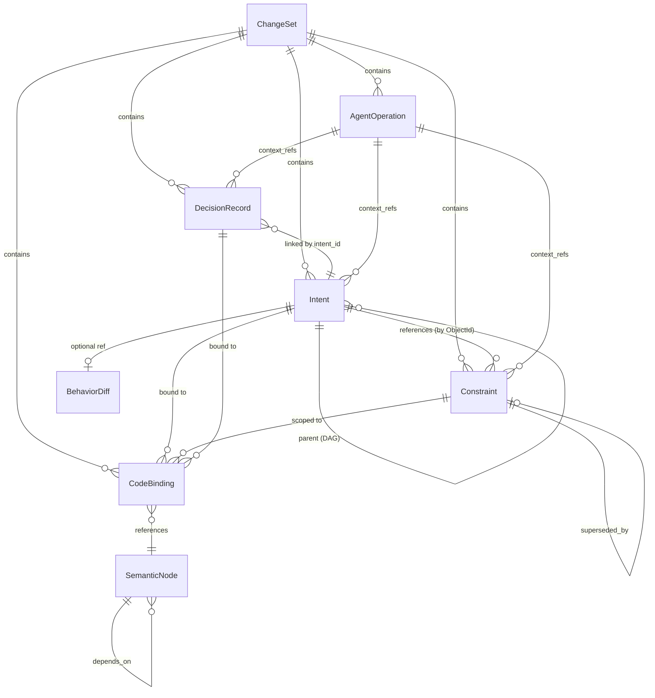
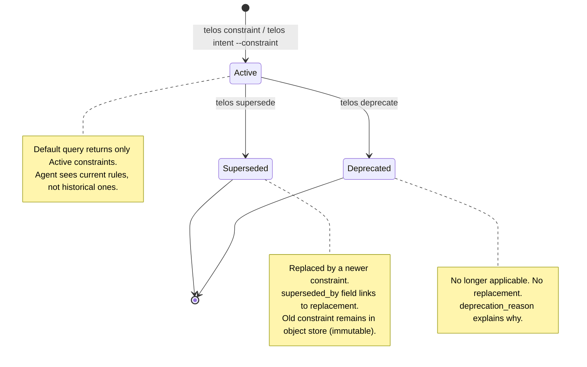
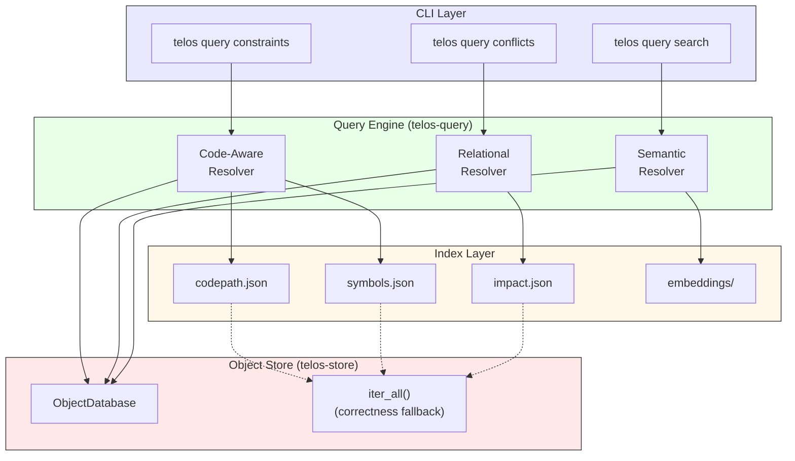
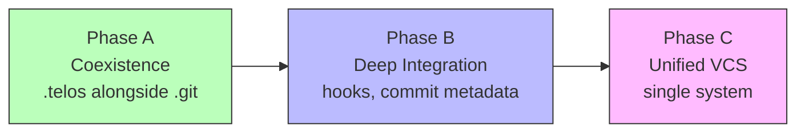
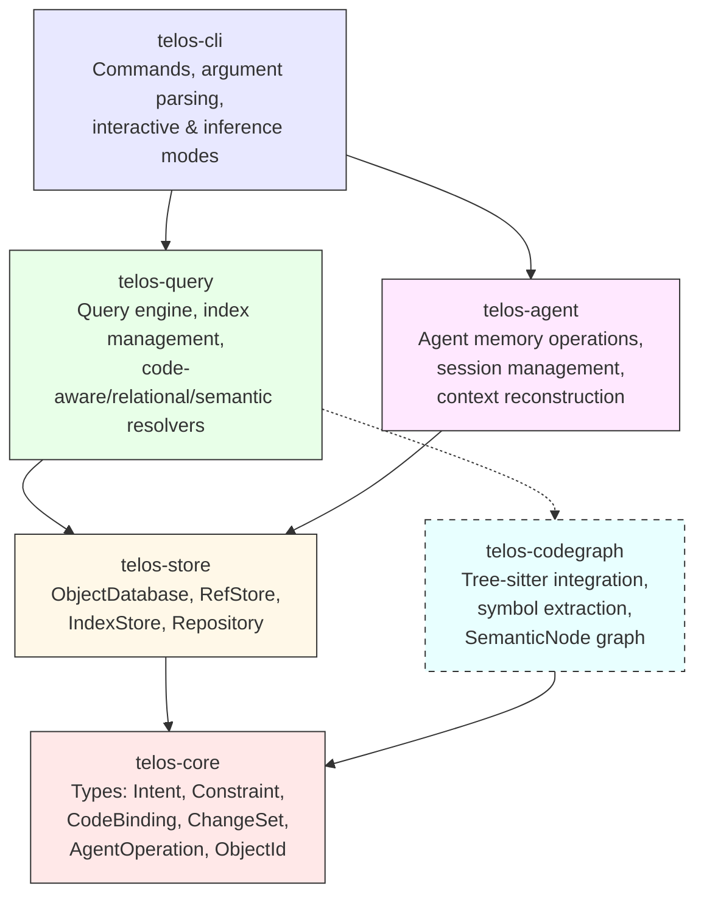

# Telos v2 Design Document

**Status:** Draft
**Date:** 2026-02-28
**Audience:** Contributors, reviewers, potential adopters

---

## Table of Contents

1. [Executive Summary](#1-executive-summary)
2. [Problem Restatement](#2-problem-restatement)
3. [Telos v2 Vision](#3-telos-v2-vision)
4. [Core Hypothesis (Expanded)](#4-core-hypothesis-expanded)
5. [Data Model v2](#5-data-model-v2)
6. [Constraint Lifecycle](#6-constraint-lifecycle)
7. [Code Binding Model](#7-code-binding-model)
8. [Query Architecture](#8-query-architecture)
9. [Agent Memory Model](#9-agent-memory-model)
10. [Storage Architecture v2](#10-storage-architecture-v2)
11. [CLI Redesign](#11-cli-redesign)
12. [Git Integration Path](#12-git-integration-path)
13. [Crate Architecture v2](#13-crate-architecture-v2)
14. [Experiment Redesign](#14-experiment-redesign)
15. [Criticism Resolution Map](#15-criticism-resolution-map)
16. [Implementation Roadmap](#16-implementation-roadmap)
17. [Appendices](#17-appendices)

---

## 1. Executive Summary

Telos v1 demonstrated a plausible concept: structured, queryable intent data can change how AI agents make decisions during code review. A four-agent dialectical review ([docs/REVIEW.md](REVIEW.md)) confirmed the architecture is sound but the evidence is circular — hand-authored responses, keyword scoring, prompt asymmetry, and no false-positive testing mean the core hypothesis remains unproven.

Telos v2 is not an incremental fix. It is a concept reshaping built on three pivots:

1. **Code review tool → Agent persistent memory.** Telos v1 positioned itself as a code review enhancement. v2 recognizes that code review is one application of a broader capability: giving AI agents a structured, queryable memory layer that persists across sessions, agents, and time. Constraints, decisions, and intents are the vocabulary; memory is the mission.

2. **Git companion → Next-generation version control.** Telos v1 sat alongside Git as a metadata sidecar. v2 designs toward a unified commit model where code changes, intent, constraints, and decisions are captured in a single atomic operation — the `ChangeSet`. The long-term trajectory is a version control system that tracks *why* with the same rigor Git tracks *what*.

3. **Immutable-and-forget → Constraint lifecycle.** Telos v1's immutability was celebrated as architectural soundness but created a staleness liability: constraints that reference deleted modules carry the same authority as current ones. v2 introduces first-class constraint lifecycle management — constraints are born, superseded, and deprecated without breaking the immutable object graph.

**The unified commit concept:** A `ChangeSet` bundles a tree diff (code changes), the intents that motivated them, the constraints they must respect, the decisions they embody, and the code locations they bind to — all as a single, content-addressable, atomically committed unit. An agent reviewing a change sees not just what changed but the full reasoning chain, in one query.

---

## 2. Problem Restatement

### 2.1 What Git Tracks vs. What It Doesn't

Git is a content-addressable filesystem for source code. It tracks:
- File contents (blobs)
- Directory structure (trees)
- Commit metadata: author, timestamp, message, parent commits
- Branches and tags (refs)

Git does not track:
- **Why** a change was made beyond a free-text commit message
- **Constraints** the code must respect (security invariants, performance budgets, API contracts)
- **Decisions** and their rationale (why library X over Y, why pattern A over B)
- **Relationships** between constraints and code locations (which functions are bound by which rules)
- **Agent context** — what an AI agent knew, decided, or attempted in a prior session

The gap between "what changed" and "why it changed" is filled by informal artifacts: commit messages, PR descriptions, code comments, Slack threads, meeting notes. These are unstructured, unqueryable, and decay rapidly.

### 2.2 Why Flat Files Are Insufficient — The Query Argument

The skeptic's strongest critique of Telos v1 ([S6]) asked: why not just use a `CONSTRAINTS.md` file? The same constraint text, delivered as a flat file, might produce the same agent behavior. This is a fair challenge, and it identifies the central design question for v2: **what does Telos provide that flat files cannot?**

The answer is **queryability**. A `CONSTRAINTS.md` file is a document. Telos is a database. The difference matters when the question is not "show me all constraints" but:

- "Show me constraints that apply to `src/auth/mod.rs`" → requires code binding index
- "Show me constraints that conflict with each other" → requires relational graph traversal
- "Show me constraints similar to 'authentication tokens must expire'" → requires semantic search
- "Show me the constraint chain: original → superseded → current" → requires lifecycle DAG traversal
- "Show me what Agent-7 decided about rate limiting in session 42" → requires structured agent logs
- "Show me all constraints at severity `Must` that have stale code bindings" → requires multi-dimensional filtering

### 2.3 Concrete Examples Where grep Fails

**Example 1: Scoped constraint lookup**

A developer adds a new endpoint to `src/api/payments.rs`. An AI agent needs to know what constraints apply.

| Approach | Command | Result |
|----------|---------|--------|
| `CONSTRAINTS.md` | `grep -i payment CONSTRAINTS.md` | Returns every line mentioning "payment" — including constraints about the payment *UI*, payment *email templates*, and a paragraph about payment *history*. No way to scope to the API module. |
| ADR files | `grep -rl payment docs/adr/` | Returns ADR files mentioning payment. Developer must open each, read it, determine relevance. No machine-readable structure. |
| Telos v2 | `telos query constraints --file src/api/payments.rs` | Returns exactly the constraints bound to that file, with severity, status, and the intent that created them. |

**Example 2: Constraint conflict detection**

Two teams independently add constraints: "API responses must complete within 200ms" and "All API responses must include full audit trails." These conflict (audit trail generation adds latency). grep cannot detect this — it requires understanding the *semantic relationship* between constraints. Telos v2's relational query layer can surface constraints with overlapping code bindings and opposing implications.

**Example 3: Staleness detection**

A function `validate_token()` in `src/auth/mod.rs` is refactored and renamed to `verify_credentials()` in `src/auth/credentials.rs`. Constraints bound to the old function still reference `src/auth/mod.rs:validate_token`. grep on the old path returns nothing (file moved). grep on "validate_token" returns nothing (renamed). Telos v2's code binding model flags the binding as `Unresolved` and surfaces it during `telos check`.

---

## 3. Telos v2 Vision

### 3.1 One-Sentence Thesis

**Telos is a structured, queryable memory layer for software development — capturing intent, constraints, decisions, and agent operations as content-addressable objects with code-level bindings, enabling AI agents to reason about *why* code exists with the same precision they reason about *what* code does.**

### 3.2 Unified Commit Model Preview

The long-term target is the `ChangeSet` — a single atomic unit that captures:

```
ChangeSet = TreeDiff + Intents + Constraints + Decisions + CodeBindings + AgentOperations
```

In the near term (Phases A-B), Telos coexists with Git. In the long term (Phase C), the `ChangeSet` replaces both the Git commit and the Telos intent as the fundamental unit of change.

### 3.3 Differentiation Table

| Capability | Git | ADRs | CONSTRAINTS.md | Telos v2 |
|------------|-----|------|----------------|----------|
| Track code changes | Yes | No | No | Yes (ChangeSet) |
| Track intent/rationale | Commit message (free text) | Yes (prose) | No | Yes (structured) |
| Track constraints | No | Sometimes | Yes (prose) | Yes (structured, scoped, versioned) |
| Track decisions | No | Yes (prose) | No | Yes (structured, linked) |
| Track agent operations | No | No | No | Yes |
| Code-aware queries | No | No | No | Yes |
| Relational queries | `git log --follow` | No | No | Yes |
| Semantic queries | No | No | No | Yes (Phase 3) |
| Constraint lifecycle | N/A | Manual | Manual | First-class (Active/Superseded/Deprecated) |
| Machine-readable | Diff/patch | No | No | Yes (JSON, structured objects) |
| Content-addressable | Yes | No | No | Yes |
| Immutable history | Yes | No | No | Yes |

---

## 4. Core Hypothesis (Expanded)

### 4.1 Original Hypothesis (v1)

> "AI agents equipped with structured intent context make better code review decisions than agents working with Git history alone."

This hypothesis was plausible but unproven. The v1 evaluation tested it with hand-authored responses, keyword scoring, and asymmetric prompts — producing results that could not distinguish tool value from evaluation design.

### 4.2 Expanded Hypothesis (v2)

> "AI agents with access to a structured, queryable memory layer — containing constraints, decisions, code bindings, and prior agent operations — exhibit measurably higher autonomy, accuracy, and consistency across multi-session tasks than agents relying on code and unstructured documentation alone."

This hypothesis is broader (not just code review), more specific (defines the memory layer contents), and designed for falsification.

### 4.3 Sub-Hypotheses

- **H1 (Authority):** Agents with structured constraints reject constraint-violating changes at a higher rate than agents with unstructured constraint text (CONSTRAINTS.md). — *Isolates tool value from information value, addressing [S6].*
- **H2 (Persistence):** Agents with access to prior agent operation logs complete multi-session tasks with fewer errors and less repeated work. — *Tests the agent memory hypothesis beyond code review.*
- **H3 (Staleness):** Agents with lifecycle-managed constraints (Active/Superseded/Deprecated) produce fewer false rejections than agents with flat, unmaintained constraint lists. — *Tests whether lifecycle management addresses [P2].*
- **H4 (Coordination):** Multiple agents sharing a Telos memory layer make fewer conflicting decisions than agents without shared state. — *Tests the multi-agent coordination hypothesis.*

### 4.4 Falsification Criteria

The expanded hypothesis would be disproven if:

1. **No authority gap with identical prompts.** Real LLM experiments (N>=30) with identical prompts show no statistically significant difference in rejection rates between Telos-equipped and unequipped agents.
2. **CONSTRAINTS.md achieves parity.** A flat-file constraint baseline produces equivalent agent accuracy, making Telos's query architecture unnecessary overhead.
3. **Staleness causes net harm.** Longitudinal testing shows that stale constraints cause more false rejections than active constraints prevent real violations, even with lifecycle management.
4. **Agent memory doesn't persist usefully.** Multi-session experiments show agents don't meaningfully benefit from prior operation logs — they re-derive context from code as effectively.
5. **Overhead exceeds benefit.** Real-world adoption studies show that the cost of maintaining Telos objects exceeds the measurable improvement in development outcomes.

---

## 5. Data Model v2

### 5.1 Design Principles

1. **Extend, don't replace.** v2 objects are supersets of v1 objects. v1 objects remain valid; `telos migrate` upgrades them.
2. **Everything is content-addressable.** Every object gets a SHA-256 ObjectId. No exceptions.
3. **Code bindings are first-class.** The relationship between an object and a code location is a typed, queryable link.
4. **Constraints are objects, not strings.** Extracted from `Vec<String>` into `Constraint` objects with lifecycle, severity, and scope.

### 5.2 Type Overview



### 5.3 Retained Types (Extended)

#### Intent (extended)

```rust
pub struct Intent {
    pub author: Author,
    pub timestamp: DateTime<Utc>,
    pub statement: String,

    // CHANGED: Vec<String> → Vec<ObjectId>
    // Constraints are now first-class objects referenced by ID
    pub constraints: Vec<ObjectId>,

    #[serde(default, skip_serializing_if = "Vec::is_empty")]
    pub behavior_spec: Vec<BehaviorClause>,
    #[serde(default, skip_serializing_if = "Vec::is_empty")]
    pub parents: Vec<ObjectId>,
    #[serde(default, skip_serializing_if = "Vec::is_empty")]
    pub impacts: Vec<String>,
    #[serde(default, skip_serializing_if = "Option::is_none")]
    pub behavior_diff: Option<ObjectId>,
    #[serde(default, skip_serializing_if = "HashMap::is_empty")]
    pub metadata: HashMap<String, serde_json::Value>,

    // NEW: code locations this intent relates to
    #[serde(default, skip_serializing_if = "Vec::is_empty")]
    pub code_bindings: Vec<ObjectId>,
}
```

**Migration note:** v1 `Intent` objects with `constraints: Vec<String>` are readable by v2. `telos migrate` converts each inline string to a `Constraint` object and replaces the string with its ObjectId.

#### DecisionRecord (extended)

```rust
pub struct DecisionRecord {
    pub intent_id: ObjectId,
    pub author: Author,
    pub timestamp: DateTime<Utc>,
    pub question: String,
    pub decision: String,
    #[serde(default, skip_serializing_if = "Option::is_none")]
    pub rationale: Option<String>,
    #[serde(default, skip_serializing_if = "Vec::is_empty")]
    pub alternatives: Vec<Alternative>,
    #[serde(default, skip_serializing_if = "Vec::is_empty")]
    pub tags: Vec<String>,

    // NEW: code locations this decision relates to
    #[serde(default, skip_serializing_if = "Vec::is_empty")]
    pub code_bindings: Vec<ObjectId>,
}
```

#### BehaviorDiff (unchanged)

```rust
pub struct BehaviorDiff {
    pub intent_id: ObjectId,
    pub changes: Vec<BehaviorChange>,
    pub impact: ImpactRadius,
    #[serde(default, skip_serializing_if = "Option::is_none")]
    pub verification: Option<Verification>,
}
```

### 5.4 New Types

#### Constraint

Extracted from `Vec<String>` on Intent to become a first-class content-addressable object with lifecycle, severity, and scope.

```rust
/// Lifecycle state of a constraint.
pub enum ConstraintStatus {
    /// Currently enforced.
    Active,
    /// Replaced by a newer constraint (superseded_by is set).
    Superseded,
    /// No longer applicable (explicitly retired).
    Deprecated,
}

/// How strictly the constraint must be enforced.
pub enum ConstraintSeverity {
    /// Violation is a hard error. Cannot be overridden without supersession.
    Must,
    /// Violation is a warning. Should be followed unless explicitly justified.
    Should,
    /// Violation is advisory. Preferred practice, not enforced.
    Prefer,
}

pub struct Constraint {
    pub author: Author,
    pub timestamp: DateTime<Utc>,

    /// The constraint text (e.g., "Sessions must expire after 1 hour").
    pub statement: String,

    pub severity: ConstraintSeverity,
    pub status: ConstraintStatus,

    /// The intent that created this constraint.
    pub source_intent: ObjectId,

    /// If superseded, the ObjectId of the replacement constraint.
    #[serde(default, skip_serializing_if = "Option::is_none")]
    pub superseded_by: Option<ObjectId>,

    /// If deprecated, the reason for deprecation.
    #[serde(default, skip_serializing_if = "Option::is_none")]
    pub deprecation_reason: Option<String>,

    /// Code locations this constraint is scoped to.
    /// Empty means project-wide.
    #[serde(default, skip_serializing_if = "Vec::is_empty")]
    pub scope: Vec<ObjectId>,  // Vec<CodeBinding ObjectId>

    /// Impact areas (carried over from parent intent for denormalized query).
    #[serde(default, skip_serializing_if = "Vec::is_empty")]
    pub impacts: Vec<String>,

    #[serde(default, skip_serializing_if = "HashMap::is_empty")]
    pub metadata: HashMap<String, serde_json::Value>,
}
```

**JSON example:**
```json
{
    "type": "constraint",
    "author": { "name": "Alice", "email": "alice@example.com" },
    "timestamp": "2026-02-28T10:00:00Z",
    "statement": "Authentication tokens must expire within 1 hour",
    "severity": "Must",
    "status": "Active",
    "source_intent": "a3f29c...",
    "scope": ["b7e41d..."],
    "impacts": ["auth", "security"]
}
```

#### CodeBinding

Links any Telos object to a specific code location — file, function, module, or API endpoint.

```rust
/// What kind of code element is being bound.
pub enum BindingType {
    /// Entire file.
    File,
    /// A specific function or method.
    Function,
    /// A module (directory or mod.rs).
    Module,
    /// An API endpoint (route).
    Api,
    /// A type definition (struct, enum, trait).
    Type,
}

/// Resolution state of a code binding.
pub enum BindingResolution {
    /// Code location exists and matches.
    Resolved,
    /// Code location cannot be found (file moved, symbol renamed).
    Unresolved,
    /// Not yet checked.
    Unchecked,
}

pub struct CodeBinding {
    /// File path relative to repository root.
    pub path: String,

    /// Symbol name (function, type, module name). None for file-level bindings.
    #[serde(default, skip_serializing_if = "Option::is_none")]
    pub symbol: Option<String>,

    /// Line range [start, end] inclusive. None for whole-file or symbol-level bindings.
    #[serde(default, skip_serializing_if = "Option::is_none")]
    pub span: Option<(u32, u32)>,

    pub binding_type: BindingType,
    pub resolution: BindingResolution,

    /// The Telos object this binding belongs to.
    pub bound_object: ObjectId,

    #[serde(default, skip_serializing_if = "HashMap::is_empty")]
    pub metadata: HashMap<String, serde_json::Value>,
}
```

**JSON example:**
```json
{
    "type": "code_binding",
    "path": "src/auth/mod.rs",
    "symbol": "validate_token",
    "span": [42, 67],
    "binding_type": "Function",
    "resolution": "Resolved",
    "bound_object": "c9d83e..."
}
```

#### AgentOperation

A content-addressable log entry for an AI agent's operation. Captures what the agent did, what context it consulted, and what it produced.

```rust
/// What the agent did.
pub enum OperationType {
    /// Agent reviewed code changes.
    Review,
    /// Agent generated code.
    Generate,
    /// Agent made a decision.
    Decide,
    /// Agent queried Telos for context.
    Query,
    /// Agent detected a constraint violation.
    Violation,
    /// Free-form operation.
    Custom(String),
}

/// Outcome of the operation.
pub enum OperationResult {
    /// Operation completed successfully.
    Success,
    /// Operation completed but with warnings.
    Warning(String),
    /// Operation failed.
    Failure(String),
    /// Operation was skipped (e.g., no relevant constraints).
    Skipped,
}

pub struct AgentOperation {
    /// Caller-controlled agent identifier.
    pub agent_id: String,

    /// Caller-controlled session identifier.
    pub session_id: String,

    pub timestamp: DateTime<Utc>,

    pub operation: OperationType,
    pub result: OperationResult,

    /// Human-readable summary of what happened.
    pub summary: String,

    /// Telos objects the agent consulted during this operation.
    #[serde(default, skip_serializing_if = "Vec::is_empty")]
    pub context_refs: Vec<ObjectId>,

    /// Files the agent read or modified.
    #[serde(default, skip_serializing_if = "Vec::is_empty")]
    pub files_touched: Vec<String>,

    /// Parent operation (for multi-step workflows).
    #[serde(default, skip_serializing_if = "Option::is_none")]
    pub parent_op: Option<ObjectId>,

    #[serde(default, skip_serializing_if = "HashMap::is_empty")]
    pub metadata: HashMap<String, serde_json::Value>,
}
```

**JSON example:**
```json
{
    "type": "agent_operation",
    "agent_id": "claude-code",
    "session_id": "sess-20260228-abc",
    "timestamp": "2026-02-28T14:30:00Z",
    "operation": "Review",
    "result": "Success",
    "summary": "Reviewed PR #42: found 1 constraint violation in auth module",
    "context_refs": ["a3f29c...", "b7e41d..."],
    "files_touched": ["src/auth/mod.rs", "src/auth/token.rs"]
}
```

#### ChangeSet

The unified commit — the long-term replacement for both Git commits and Telos intents. Bundles code changes with their full reasoning chain.

```rust
pub struct TreeDiff {
    /// Files added, modified, or deleted.
    pub files: Vec<FileDiff>,
}

pub struct FileDiff {
    pub path: String,
    pub change_type: FileChangeType,
    /// Content hash before change (None for new files).
    #[serde(default, skip_serializing_if = "Option::is_none")]
    pub before: Option<String>,
    /// Content hash after change (None for deleted files).
    #[serde(default, skip_serializing_if = "Option::is_none")]
    pub after: Option<String>,
}

pub enum FileChangeType {
    Added,
    Modified,
    Deleted,
    Renamed { from: String },
}

pub struct ChangeSet {
    pub author: Author,
    pub timestamp: DateTime<Utc>,
    pub message: String,

    /// Parent changeset(s) — forms DAG like Git commits.
    #[serde(default, skip_serializing_if = "Vec::is_empty")]
    pub parents: Vec<ObjectId>,

    /// Code changes (tree diff).
    pub tree_diff: TreeDiff,

    /// Intents that motivated this change.
    #[serde(default, skip_serializing_if = "Vec::is_empty")]
    pub intents: Vec<ObjectId>,

    /// Constraints created or referenced by this change.
    #[serde(default, skip_serializing_if = "Vec::is_empty")]
    pub constraints: Vec<ObjectId>,

    /// Decisions made as part of this change.
    #[serde(default, skip_serializing_if = "Vec::is_empty")]
    pub decisions: Vec<ObjectId>,

    /// Code bindings established or updated.
    #[serde(default, skip_serializing_if = "Vec::is_empty")]
    pub code_bindings: Vec<ObjectId>,

    /// Agent operations that contributed to this change.
    #[serde(default, skip_serializing_if = "Vec::is_empty")]
    pub agent_operations: Vec<ObjectId>,

    #[serde(default, skip_serializing_if = "HashMap::is_empty")]
    pub metadata: HashMap<String, serde_json::Value>,
}
```

```mermaid
graph TB
    CS[ChangeSet]
    TD[TreeDiff<br/>src/auth/mod.rs modified<br/>src/auth/token.rs added]
    I1[Intent<br/>"Add token rotation"]
    C1[Constraint<br/>"Tokens must expire within 1h"<br/>Must / Active]
    C2[Constraint<br/>"Rotation must not cause downtime"<br/>Should / Active]
    D1[DecisionRecord<br/>"Use sliding window rotation"]
    CB1[CodeBinding<br/>src/auth/mod.rs:rotate_token]
    CB2[CodeBinding<br/>src/auth/token.rs:Token]
    AO[AgentOperation<br/>claude-code reviewed changes]

    CS --> TD
    CS --> I1
    CS --> C1
    CS --> C2
    CS --> D1
    CS --> CB1
    CS --> CB2
    CS --> AO

    I1 -.-> C1
    I1 -.-> C2
    D1 -.-> I1
    C1 -.-> CB1
    CB1 -.-> TD
    CB2 -.-> TD

    style CS fill:#f9f,stroke:#333,stroke-width:2px
    style TD fill:#fbb,stroke:#333
    style I1 fill:#bfb,stroke:#333
    style C1 fill:#bbf,stroke:#333
    style C2 fill:#bbf,stroke:#333
    style D1 fill:#fbf,stroke:#333
    style CB1 fill:#ff9,stroke:#333
    style CB2 fill:#ff9,stroke:#333
    style AO fill:#9ff,stroke:#333
```

#### SemanticNode

A node in the code graph — represents a symbol (function, type, module) and its dependencies. Used by the code-aware query engine to answer "what constraints apply to this symbol and everything it depends on?"

```rust
pub enum NodeType {
    Function,
    Method,
    Struct,
    Enum,
    Trait,
    Module,
    Constant,
    TypeAlias,
}

pub struct SemanticNode {
    /// File path relative to repository root.
    pub path: String,

    /// Symbol name.
    pub symbol: String,

    pub node_type: NodeType,

    /// Line range in source file.
    pub span: (u32, u32),

    /// Symbols this node depends on (calls, uses, implements).
    #[serde(default, skip_serializing_if = "Vec::is_empty")]
    pub dependencies: Vec<SymbolRef>,

    /// Symbols that depend on this node.
    #[serde(default, skip_serializing_if = "Vec::is_empty")]
    pub dependents: Vec<SymbolRef>,
}

pub struct SymbolRef {
    pub path: String,
    pub symbol: String,
}
```

### 5.5 Type Tag Registry

| Type | Tag | v1 | v2 |
|------|-----|----|----|
| Intent | `intent` | Yes | Extended |
| DecisionRecord | `decision_record` | Yes | Extended |
| BehaviorDiff | `behavior_diff` | Yes | Unchanged |
| IntentStreamSnapshot | `intent_stream_snapshot` | Yes | Unchanged |
| Constraint | `constraint` | No | New |
| CodeBinding | `code_binding` | No | New |
| AgentOperation | `agent_operation` | No | New |
| ChangeSet | `change_set` | No | New |
| SemanticNode | `semantic_node` | No | New (Phase 3) |

---

## 6. Constraint Lifecycle

### 6.1 The Staleness Problem

In v1, constraints are inline strings on Intent objects. Once written, they exist forever with no way to mark them as outdated. After months of refactoring, the intent store accumulates constraints that reference deleted modules, changed APIs, and revised policies. An AI agent querying constraints gets a mix of current and stale rules, with no way to distinguish them. The "authority gap" that makes Telos useful when constraints are accurate makes it actively harmful when they are stale — the agent rejects valid changes based on outdated rules.

This was identified as a critical risk by all four reviewers ([P2], [E6]).

### 6.2 State Machine



**Transitions:**

- **Active → Superseded:** A new constraint replaces an existing one. The old constraint's `superseded_by` field is set to the new constraint's ObjectId. Since objects are immutable, supersession creates a *new* Constraint object with `status: Superseded` and `superseded_by: <new_id>`, then updates the index.
- **Active → Deprecated:** A constraint is retired without replacement. A new Constraint object is created with `status: Deprecated` and `deprecation_reason` set.

**Immutability note:** The original Active constraint object is never modified. Supersession and deprecation create new objects that record the transition. The index maps from the original ObjectId to its current lifecycle state.

### 6.3 Commands

```bash
# Create a standalone constraint (not inline on an intent)
telos constraint \
  --statement "API responses must complete within 200ms" \
  --severity must \
  --scope src/api/

# Supersede an existing constraint with a new one
telos supersede <old-constraint-id> \
  --statement "API responses must complete within 500ms for batch endpoints" \
  --severity should \
  --reason "Batch endpoints have different latency requirements"

# Deprecate a constraint without replacement
telos deprecate <constraint-id> \
  --reason "Module removed in v3.0 migration"
```

### 6.4 Query Behavior

| Query | Default (Active only) | `--all` flag |
|-------|-----------------------|--------------|
| `telos query constraints` | Returns only Active constraints | Returns all constraints with status |
| `telos query constraints --file X` | Active constraints bound to file X | All constraints ever bound to file X |
| `telos query chain <id>` | N/A | Returns full chain: original → superseded → ... → current |

The default behavior ensures that agents see only current, enforced constraints unless they explicitly request the full history. This directly addresses [P2] (staleness) without sacrificing [A3] (immutable history).

---

## 7. Code Binding Model

### 7.1 What's Tracked

Code bindings create typed links between Telos objects and code locations. Five binding types cover the common cases:

| Binding Type | Example | Granularity |
|-------------|---------|-------------|
| `File` | `src/auth/mod.rs` | Entire file |
| `Function` | `src/auth/mod.rs:validate_token` | Single function/method |
| `Module` | `src/auth/` | Directory or module |
| `Api` | `POST /api/v1/login` | API endpoint (route) |
| `Type` | `src/auth/mod.rs:TokenClaims` | Struct, enum, or trait |

### 7.2 Staleness Detection

When code changes, bindings may become stale. The `telos check` command (and pre-commit hook) detects this:

1. **File moved or deleted:** Binding path no longer exists → resolution changes to `Unresolved`.
2. **Symbol renamed:** Binding symbol not found at path → resolution changes to `Unresolved`.
3. **Symbol moved:** Symbol found in a different file → resolution changes to `Unresolved`, suggestion emitted.

Detection runs during:
- `telos check` (explicit)
- `telos reindex` (rebuilds all indexes and re-resolves bindings)
- Pre-commit hook (automatic, if configured)

### 7.3 Symbol Extraction

Code bindings reference symbols (functions, types, modules). To verify that a binding is still valid, Telos needs to extract symbols from source code.

**Phase 1-2: File-level only.** Bindings at the file level require only filesystem checks. Function and type bindings are stored but resolution is `Unchecked` until the code graph crate is available.

**Phase 3: Tree-sitter integration.** The `telos-codegraph` crate uses tree-sitter to parse source files and extract a symbol-level graph. This enables:
- Verifying that `src/auth/mod.rs:validate_token` still exists
- Detecting renames (same function body, different name)
- Building the `SemanticNode` graph for dependency-aware queries

**Design decision:** Symbol-level code graph, not full AST. Telos needs to answer "what constraints apply to this function?" — not "what is the parse tree of this expression." The symbol graph (functions, types, modules, dependencies) is sufficient and dramatically simpler than a full AST representation.

### 7.4 Binding Commands

```bash
# Bind a constraint to a file
telos bind <constraint-id> --file src/auth/mod.rs

# Bind a constraint to a function
telos bind <constraint-id> --file src/auth/mod.rs --symbol validate_token

# Bind a constraint to a module
telos bind <constraint-id> --module src/auth/

# Check all bindings for staleness
telos check --bindings
```

---

## 8. Query Architecture

The query layer is Telos v2's primary differentiator. It provides three types of queries that flat files cannot support, backed by an index layer that makes them fast.

### 8.1 Architecture Overview



### 8.2 Query Type 1: Code-Aware

Code-aware queries answer: "What Telos objects are relevant to this code location?"

```bash
# Constraints bound to a specific file
telos query constraints --file src/auth/mod.rs

# Constraints bound to a specific function
telos query constraints --file src/auth/mod.rs --symbol validate_token

# All Telos objects (intents, constraints, decisions) bound to a file
telos query bindings --file src/auth/mod.rs

# Constraints in a module (recursive)
telos query constraints --module src/auth/
```

**Index used:** `codepath.json` (maps file paths to ObjectIds), `symbols.json` (maps symbol names to ObjectIds).

**Resolution flow:**
1. Look up file path in `codepath.json` → list of ObjectIds
2. Filter by binding type and symbol name if specified
3. Fetch objects from ObjectDatabase
4. Filter by object type (constraint, intent, etc.) and status (Active by default)

### 8.3 Query Type 2: Relational

Relational queries answer: "How do Telos objects relate to each other?"

```bash
# Find constraints that conflict (overlapping scope, opposing statements)
telos query conflicts

# Find all objects that depend on a constraint
telos query dependents --constraint <id>

# Show the constraint lifecycle chain
telos query chain --constraint <id>

# Show all constraints created by an intent
telos query constraints --intent <id>

# Show all agent operations in a session
telos query agent-ops --session <session-id>

# Show impact areas and their constraint counts
telos query impacts
```

**Index used:** `impact.json` (maps impact tags to ObjectIds). Cross-references resolved by following ObjectId links in the object graph.

**Conflict detection** (Phase 2): Two constraints conflict if they have overlapping code bindings and their statements contain opposing directives. Phase 1 implements structural overlap detection (same file/function). Phase 3 adds semantic conflict detection using embeddings.

### 8.4 Query Type 3: Semantic

Semantic queries answer: "What Telos objects are conceptually related to this natural language query?"

```bash
# Find constraints related to a natural language query
telos query search "security requirements for authentication"

# Find intents similar to a description
telos query search "rate limiting for API endpoints" --type intent

# Find decisions about a topic
telos query search "database migration strategy" --type decision
```

**Index used:** Embedding store (`.telos/embeddings/`). Each Telos object's text content (statement, constraint text, decision text) is embedded and stored for cosine-similarity search.

**Phase 3 only.** Semantic search requires an embedding model (local or API-based). The storage architecture is designed for it now, but implementation is deferred. Code-aware and relational queries provide the primary differentiator in Phases 1-2.

### 8.5 Index Design

**Design principle:** Indexes are caches, not primary storage. They are derived from the object store and can be rebuilt at any time with `telos reindex`. If an index is missing or corrupted, queries fall back to `iter_all()` (O(n) scan), which is always the correctness baseline.

Index files are stored in `.telos/indexes/` and protected by lockfile-based atomic writes.

#### impact.json

```json
{
    "version": 2,
    "entries": {
        "auth": [
            { "id": "a3f29c...", "type": "intent" },
            { "id": "b7e41d...", "type": "constraint" },
            { "id": "c9d83e...", "type": "decision_record" }
        ],
        "security": [
            { "id": "a3f29c...", "type": "intent" },
            { "id": "d1e2f3...", "type": "constraint" }
        ]
    }
}
```

#### codepath.json

```json
{
    "version": 2,
    "entries": {
        "src/auth/mod.rs": [
            { "id": "e4f5a6...", "type": "code_binding", "symbol": "validate_token", "binding_type": "Function" },
            { "id": "f6a7b8...", "type": "code_binding", "symbol": null, "binding_type": "File" }
        ],
        "src/api/payments.rs": [
            { "id": "a8b9c0...", "type": "code_binding", "symbol": "process_payment", "binding_type": "Function" }
        ]
    }
}
```

#### symbols.json

```json
{
    "version": 2,
    "entries": {
        "validate_token": [
            { "id": "e4f5a6...", "path": "src/auth/mod.rs", "binding_type": "Function" }
        ],
        "Token": [
            { "id": "d2e3f4...", "path": "src/auth/token.rs", "binding_type": "Type" }
        ]
    }
}
```

### 8.6 Index Maintenance

Indexes are updated on every write operation that creates a new object:
1. `telos intent` → updates `impact.json`
2. `telos constraint` → updates `impact.json`, `codepath.json`, `symbols.json`
3. `telos bind` → updates `codepath.json`, `symbols.json`
4. `telos agent-log` → updates `impact.json` (if agent operation references impact areas)

Indexes can be fully rebuilt:
```bash
telos reindex  # Rebuilds all indexes from object store
```

---

## 9. Agent Memory Model

### 9.1 Overview

Telos v2 positions itself as a persistent memory layer for AI agents. The `AgentOperation` object captures what an agent did, what context it consulted, and what it produced. Over time, this creates a queryable history of agent behavior that enables:

- **Cross-session context recovery:** An agent starting a new session can query what the previous session did and where it left off.
- **Multi-agent coordination:** Multiple agents can see each other's operations, avoiding duplicated work and conflicting decisions.
- **Debugging and audit:** When an agent makes a mistake, the operation log provides a trace of what context it had and what decisions it made.

### 9.2 Agent Session Streams

Each agent session gets a stream — a named sequence of operations. Streams are stored as refs (like intent streams) and point to the most recent operation in the session.

```
.telos/refs/agents/
├── claude-code/
│   ├── sess-20260228-abc     → tip: <AgentOperation ObjectId>
│   └── sess-20260227-def     → tip: <AgentOperation ObjectId>
└── copilot/
    └── sess-20260228-ghi     → tip: <AgentOperation ObjectId>
```

An agent's session stream is a linked list of operations (via `parent_op`), enabling traversal from most recent to oldest.

### 9.3 Cross-Session Context Reconstruction

When an agent starts a new session, it can reconstruct what happened in prior sessions:

```bash
# Show all sessions for an agent
telos query agent-ops --agent claude-code

# Show operations in a specific session
telos query agent-ops --session sess-20260228-abc

# Show the last N operations across all sessions for an agent
telos query agent-ops --agent claude-code --last 10

# Show what context an agent consulted
telos show <agent-op-id> --json
# → context_refs: ["a3f29c...", "b7e41d..."] → can fetch these objects
```

### 9.4 Multi-Agent Shared State

Multiple agents share the same Telos store. Each agent writes to its own session stream, but all operations are visible to all agents. This enables coordination without explicit message passing:

- Agent A creates a constraint → Agent B sees it in query results
- Agent A logs a violation → Agent B can check if the violation was addressed
- Agent A makes a decision → Agent B can query the decision and its rationale

**Concurrency model:** Lockfile-based atomic writes (inherited from v1) prevent corruption. No distributed locking — operations are append-only, and conflicts are resolved by timestamp ordering.

### 9.5 Agent Identity Model

Agent identity is **caller-controlled**. The agent provides its own `agent_id` and `session_id` when logging operations. Telos does not authenticate agents — this is a coordination layer, not a security boundary.

```bash
telos agent-log \
  --agent claude-code \
  --session sess-20260228-abc \
  --operation review \
  --summary "Reviewed PR #42: found 1 constraint violation" \
  --context-ref a3f29c... \
  --context-ref b7e41d... \
  --file src/auth/mod.rs
```

**Design decision:** No authentication. Agent identity is for coordination and attribution, not access control. If access control is needed (e.g., in a team setting), it should be implemented at the filesystem level (permissions on `.telos/`) or at a higher layer. Telos focuses on being a useful memory store, not a security system.

---

## 10. Storage Architecture v2

### 10.1 Directory Layout

```
.telos/
├── objects/              # Content-addressable store (retained from v1)
│   ├── a3/              #   Fan-out by first 2 hex chars
│   │   └── f29c...(62)  #   Object file (canonical JSON)
│   └── ...
├── refs/
│   ├── streams/          # Intent streams (retained from v1)
│   │   ├── main
│   │   └── feature-auth
│   └── agents/           # NEW: agent session streams
│       ├── claude-code/
│       │   └── sess-...
│       └── copilot/
│           └── sess-...
├── indexes/              # NEW: query indexes (caches, rebuildable)
│   ├── impact.json       #   impact_tag → [ObjectId]
│   ├── codepath.json     #   file_path → [CodeBinding]
│   └── symbols.json      #   symbol_name → [CodeBinding]
├── embeddings/           # NEW: semantic search store (Phase 3)
│   └── ...
├── graph/                # NEW: code graph cache (Phase 3)
│   └── ...
├── config.json           # Repository config (version: 2)
└── HEAD                  # Current stream ref
```

### 10.2 Changes from v1

| Component | v1 | v2 |
|-----------|----|----|
| `objects/` | Content-addressable, fan-out | Unchanged (new object types stored the same way) |
| `refs/streams/` | Mutable stream refs | Unchanged |
| `refs/agents/` | N/A | New: agent session streams |
| `indexes/` | N/A | New: query acceleration layer |
| `embeddings/` | N/A | New: semantic search (Phase 3) |
| `graph/` | N/A | New: code graph cache (Phase 3) |
| `config.json` | `{ "version": 1 }` | `{ "version": 2, ... }` |

### 10.3 Config v2

```json
{
    "version": 2,
    "created_at": "2026-02-28T10:00:00Z",
    "features": {
        "constraints": true,
        "code_bindings": true,
        "agent_ops": true,
        "semantic_search": false,
        "code_graph": false
    }
}
```

### 10.4 Migration from v1

```bash
telos migrate
```

The migration command:
1. Reads `config.json`, verifies version 1.
2. For each Intent object with inline `constraints: Vec<String>`:
   - Creates a `Constraint` object for each string (status: Active, severity: Should).
   - Replaces the inline string with the new Constraint's ObjectId.
   - Writes the updated Intent as a new object.
   - Updates any stream refs that point to the old Intent to point to the new one.
3. Creates the `indexes/` directory and runs `telos reindex`.
4. Updates `config.json` to version 2.

**Backward compatibility:** v2 can read v1 objects directly. The `constraints: Vec<String>` format is detected and handled transparently — inline strings are treated as Active/Should constraints for query purposes. Migration is recommended but not required for basic operation.

---

## 11. CLI Redesign

### 11.1 Three Modes

The v1 CLI required explicit flags for every operation — a tax that the Practitioner critique ([P1]) correctly identified as an adoption barrier. v2 introduces three modes:

**1. Explicit mode (retained, for CI/automation):**
```bash
telos intent \
  --statement "Add rate limiting to API" \
  --constraint "Must not exceed 100 req/min per user" \
  --impact api \
  --impact performance
```

**2. Interactive mode (new, for humans):**
```bash
telos intent
# → What is the intent? Add rate limiting to API
# → Any constraints? (enter each on a line, blank to finish)
#   Must not exceed 100 req/min per user
#
# → Impact areas? (comma-separated) api, performance
# → Created intent [main] a3f29c...
```

**3. Inference mode (new, for AI agent automation):**
```bash
telos intent --infer
# Reads staged Git files, analyzes changes, auto-generates:
# - Intent statement from diff summary
# - Constraints from code patterns (e.g., validation functions → constraints)
# - Impact areas from file paths
# - Code bindings from changed functions
# Agent reviews and confirms or edits before committing
```

### 11.2 Command Reference

| Command | Synopsis | Mode | Description |
|---------|----------|------|-------------|
| `init` | `telos init` | All | Initialize `.telos/` repository |
| `intent` | `telos intent [-s ...] [--infer]` | All | Create intent (explicit, interactive, or inferred) |
| `decide` | `telos decide [--intent ...]` | All | Record a decision |
| `constraint` | `telos constraint -s ...` | All | Create a standalone constraint |
| `supersede` | `telos supersede <id> -s ...` | All | Supersede a constraint |
| `deprecate` | `telos deprecate <id> --reason ...` | All | Deprecate a constraint |
| `bind` | `telos bind <id> --file ...` | All | Create a code binding |
| `check` | `telos check [--bindings] [--constraints]` | All | Validate bindings and constraints against code |
| `agent-log` | `telos agent-log --agent ... --operation ...` | Explicit | Log an agent operation |
| `query` | `telos query <subcommand>` | All | Query the store (see Section 8) |
| `context` | `telos context --impact <area>` | All | Aggregate context for an impact area |
| `reindex` | `telos reindex` | All | Rebuild all indexes from object store |
| `migrate` | `telos migrate` | All | Migrate v1 store to v2 |
| `log` | `telos log [-n ...]` | All | Show intent history |
| `show` | `telos show <id>` | All | Display any object by ID |
| `stream` | `telos stream <subcommand>` | All | Manage intent streams |

### 11.3 New Command Details

#### `telos check`

Validates the current codebase against Telos state:
- `--bindings`: Checks all code bindings for staleness (file exists? symbol exists?)
- `--constraints`: Checks staged changes against active constraints (are any violated?)
- `--all`: Runs all checks

```bash
$ telos check --bindings
Checking 42 code bindings...
  UNRESOLVED  src/auth/mod.rs:validate_token  (function not found — renamed?)
  UNRESOLVED  src/payments/old.rs             (file not found — deleted?)
  OK          38 bindings resolved

$ telos check --constraints
Checking staged changes against 15 active constraints...
  WARNING  src/auth/token.rs:
    Constraint c9d83e: "Tokens must expire within 1 hour" (Must)
    Change increases TOKEN_EXPIRY from 3600 to 86400
  OK  No other violations detected
```

#### `telos reindex`

Rebuilds all indexes by scanning the entire object store:
```bash
$ telos reindex
Scanning objects... 1,247 objects found
Building impact index... 23 impact areas
Building codepath index... 89 file bindings
Building symbol index... 156 symbol bindings
Indexes rebuilt in 340ms
```

---

## 12. Git Integration Path

### 12.1 Three Phases



### 12.2 Phase A: Coexistence (Current → Phase 1-2)

`.telos/` sits alongside `.git/` as an independent store. No Git integration beyond sharing the same repository root.

**What works:**
- Telos objects are created and queried independently
- Both systems track their own history
- `.telos/` can be committed to Git (shared metadata) or `.gitignored` (local-only)

**What doesn't work:**
- No automatic constraint surfacing at commit time
- No link between Git commits and Telos intents
- Developer must manually decide when to record intents

### 12.3 Phase B: Deep Integration (Phase 2-3)

Git hooks and commit metadata create a bidirectional link between Git and Telos.

**Pre-commit hook:**
```bash
# .git/hooks/pre-commit
telos check --constraints --staged
# Exits non-zero if staged changes violate active constraints
```

**Post-commit hook:**
```bash
# .git/hooks/post-commit
COMMIT_SHA=$(git rev-parse HEAD)
telos link-commit $COMMIT_SHA
# Associates the Git commit with the current Telos intent stream tip
```

**Commit metadata:**
```
commit a1b2c3d4e5f6...
Author: Alice <alice@example.com>
Date:   Fri Feb 28 14:30:00 2026 -0800

    Add token rotation for auth module

    Telos-Intent: a3f29c...
    Telos-Constraints: b7e41d..., c9d83e...
```

**Git log integration:**
```bash
telos log --git
# Shows Telos intents interleaved with Git commits
# Commit a1b2c3d → Intent a3f29c ("Add token rotation")
#   Constraints: b7e41d (Active), c9d83e (Active)
#   Decision: d1e2f3 ("Use sliding window rotation")
```

### 12.4 Phase C: Unified VCS (Phase 4+)

The `ChangeSet` replaces both Git commits and Telos intents as the fundamental unit of change. A single system tracks code changes *and* their reasoning chain.

**What changes:**
- `telos commit` replaces both `git commit` and `telos intent`
- The object store holds both code blobs and intent objects
- Branching, merging, and history traversal operate on ChangeSets
- The tree diff, intent, constraints, decisions, and bindings are a single atomic unit

**Migration strategy:**
- Existing Git history is importable: each Git commit becomes a ChangeSet with only a TreeDiff and message
- Existing Telos history is importable: each Intent becomes a ChangeSet with only intents and constraints
- Full ChangeSets are created going forward
- Git interop layer allows pushing/pulling to Git remotes (exports TreeDiff as Git commit, drops intent metadata)

---

## 13. Crate Architecture v2

### 13.1 Dependency Diagram



### 13.2 Crate Responsibilities

| Crate | Status | Responsibility |
|-------|--------|---------------|
| **telos-core** | Extended | All domain types, ObjectId, canonical serialization. Extended with Constraint, CodeBinding, AgentOperation, ChangeSet, SemanticNode. |
| **telos-store** | Extended | Content-addressable ObjectDatabase, RefStore, Lockfile. Extended with IndexStore (impact, codepath, symbols) and EmbeddingStore (Phase 3). |
| **telos-cli** | Redesigned | Command-line interface. Redesigned for three modes (explicit, interactive, inference). New commands: constraint, supersede, deprecate, bind, check, agent-log, reindex, migrate. |
| **telos-query** | **New** | Dedicated query engine. Code-aware, relational, and semantic resolvers. Manages index reads. Falls back to `iter_all()` when indexes are unavailable. |
| **telos-agent** | **New** | Agent memory operations. Session management, operation logging, cross-session context reconstruction, multi-agent coordination queries. |
| **telos-codegraph** | **New** | Tree-sitter-based symbol extraction. Builds SemanticNode graphs from source files. Used by code-aware queries and binding resolution. Optional dependency — Telos works without it (bindings default to `Unchecked`). |

### 13.3 Dependency Rules

- `telos-core` depends on nothing in the Telos workspace (only external: serde, chrono, sha2)
- `telos-store` depends only on `telos-core`
- `telos-query` depends on `telos-store` (and optionally `telos-codegraph`)
- `telos-agent` depends on `telos-store`
- `telos-codegraph` depends only on `telos-core` (and external: tree-sitter)
- `telos-cli` depends on `telos-query` and `telos-agent`

No circular dependencies. `telos-core` is the leaf. `telos-cli` is the root.

---

## 14. Experiment Redesign

### 14.1 Addressing Review Criticisms

Every experiment design decision in v2 directly addresses a specific criticism from the dialectical review:

| v2 Fix | Criticism Addressed | Detail |
|--------|---------------------|--------|
| Identical prompts for both agents | [E5] Prompt asymmetry | Both agents receive the same review instructions. The only difference is available context/tools. The Telos agent gets `telos query` output; the baseline agent gets the same information in a different format (or no information). |
| Real LLM calls, N>=30 per condition | [E1] N=1, [E3] Hand-authored, [S1] Predetermined | Every experiment runs real LLM calls (Claude, GPT-4) with at least 30 independent trials per condition. No hand-authored responses. |
| LLM-as-judge scoring | [E2] Keyword scoring, [S2] Gameable | A separate LLM evaluates responses on structured rubrics (1-5 scales for accuracy, completeness, constraint adherence, false-positive rate). Keyword scoring retained as baseline only. |
| 3+ false-positive experiments, FP <15% | [E4] No FP testing, [S4] Over-rejection | At least 3 experiments present benign, constraint-respecting changes. Success requires the Telos agent to approve them. Target: false-positive rate below 15%. |
| CONSTRAINTS.md baseline (3-way comparison) | [S6] Tool vs. information value | Every experiment runs three conditions: (1) Git only, (2) Git + CONSTRAINTS.md, (3) Git + Telos. This isolates whether value comes from having constraints at all or from Telos's queryable structure. |
| Statistical rigor | [E1] No significance testing | Effect sizes (Cohen's d), 95% confidence intervals, and McNemar's test for paired binary outcomes. Pre-registered hypotheses with alpha = 0.05. |

### 14.2 Experiment Suite

#### Experiment 1: Authority Gap (Replication)

**Hypothesis:** H1 — Telos agents reject constraint-violating changes at a higher rate than CONSTRAINTS.md agents, which in turn reject at a higher rate than Git-only agents.

**Design:**
- 3 scenarios (from v1 Experiments C, E, F) with constraint-violating changes
- 3 conditions: Git only, Git + CONSTRAINTS.md, Git + Telos
- Identical prompts across all conditions
- N=30 per condition per scenario (270 total LLM calls)
- LLM-as-judge scoring on: detection accuracy, rejection rate, reasoning quality

**Success criteria:**
- Telos rejection rate > CONSTRAINTS.md rejection rate > Git-only rejection rate
- Effect size (Telos vs Git-only) Cohen's d >= 0.5
- Effect size (Telos vs CONSTRAINTS.md) Cohen's d >= 0.3

#### Experiment 2: False Positives

**Hypothesis:** Telos agents do not over-reject benign changes (FP rate < 15%).

**Design:**
- 5 scenarios with benign, constraint-respecting changes
- Changes touch constrained code areas but do not violate any constraint
- 3 conditions (same as Experiment 1)
- N=30 per condition per scenario (450 total LLM calls)
- LLM-as-judge scoring on: approval rate, false-rejection rate, reasoning quality

**Success criteria:**
- Telos false-positive rate < 15%
- Telos FP rate not significantly higher than Git-only FP rate (McNemar p > 0.05)

#### Experiment 3: Constraint Staleness

**Hypothesis:** H3 — Agents with lifecycle-managed constraints produce fewer false rejections than agents with stale constraints.

**Design:**
- 3 scenarios where code has been refactored and old constraints are stale
- 2 conditions: Telos with stale constraints (all Active), Telos with lifecycle-managed constraints (stale ones Deprecated/Superseded)
- N=30 per condition per scenario (180 total LLM calls)
- LLM-as-judge scoring on: false-rejection rate, correct approval rate

**Success criteria:**
- Lifecycle-managed FP rate < stale-constraint FP rate
- Effect size Cohen's d >= 0.5

#### Experiment 4: Agent Memory Persistence

**Hypothesis:** H2 — Agents with access to prior session logs complete multi-session tasks with fewer errors.

**Design:**
- 3-session task: Session 1 designs a module, Session 2 implements it, Session 3 debugs an issue
- 2 conditions: Agent with Telos (sees prior session AgentOperations), Agent without (starts fresh each session)
- N=20 per condition (120 total LLM calls across 3 sessions)
- LLM-as-judge scoring on: task completion accuracy, redundant work, consistency across sessions

**Success criteria:**
- Telos agent completes tasks with fewer errors (Cohen's d >= 0.5)
- Telos agent performs less redundant work (measured by repeated queries/actions)

#### Experiment 5: Multi-Agent Coordination

**Hypothesis:** H4 — Agents sharing a Telos memory layer make fewer conflicting decisions.

**Design:**
- 2 agents work on the same codebase simultaneously (interleaved turns)
- Task: Each agent implements a feature that could conflict (e.g., both modify shared state)
- 2 conditions: Shared Telos (agents see each other's operations), No shared state
- N=20 per condition (80 total LLM calls)
- LLM-as-judge scoring on: conflict rate, decision consistency, coordination quality

**Success criteria:**
- Shared-Telos conflict rate < No-shared-state conflict rate
- Effect size Cohen's d >= 0.5

### 14.3 Infrastructure

**LLM providers:** Claude (Sonnet/Opus) and GPT-4 — experiments run on both to test generalizability.

**Scoring:**
- Primary: LLM-as-judge (GPT-4 or Claude Opus with structured rubric)
- Secondary: Keyword matching (retained as baseline for comparison with v1)
- Calibration: 50 manually scored responses to verify LLM-judge agreement (target Cohen's kappa >= 0.7)

**Reproducibility:**
- All prompts, scenarios, and rubrics version-controlled
- Random seeds fixed for reproducible LLM outputs (temperature=0)
- Raw responses stored for re-scoring
- Pre-registration document published before experiments run

---

## 15. Criticism Resolution Map

Every criticism from the dialectical review is mapped to its v2 resolution:

### Advocate Positions

| ID | Criticism | v2 Resolution |
|----|-----------|---------------|
| [A1] | Authority gap is genuine but unproven | Experiment 1 tests with real LLMs, identical prompts, N=30. H1 provides falsification criteria. |
| [A2] | Queryable model is superior to alternatives | Query architecture (Section 8) with three query types. Experiment 1 includes CONSTRAINTS.md baseline to quantify the difference. |
| [A3] | Content-addressable architecture is sound | Retained. Extended with new object types (same hashing, same DAG). |
| [A4] | Experiment A failure shows intellectual honesty | Reframed. Experiment 1 includes high-quality commit message scenarios to quantify boundary condition. |
| [A5] | Limitations are addressable | Addressed directly: real LLMs (Section 14.2), LLM-judge (14.3), N=30 (14.2), false-positive testing (Experiment 2). |
| [A6] | Prompt asymmetry reflects natural usage | Eliminated as confound. All experiments use identical prompts (Section 14.1). Natural-usage variant included as additional (non-primary) condition. |

### Skeptic Positions

| ID | Criticism | v2 Resolution |
|----|-----------|---------------|
| [S1] | Experiments don't measure agent behavior | Experiment suite uses real LLM calls exclusively (Section 14.2). |
| [S2] | Keyword scoring is unreliable | LLM-as-judge primary scoring, keyword retained as baseline only (Section 14.3). |
| [S3] | Experiment A undermines value proposition | Experiment 1 includes scenarios with good and poor commit messages, quantifying the boundary. |
| [S4] | No false-positive testing | Experiment 2: 5 benign scenarios, FP rate target <15% (Section 14.2). |
| [S5] | Simpler alternatives never compared | 3-way comparison in every experiment: Git only vs CONSTRAINTS.md vs Telos (Section 14.1). |
| [S6] | Tool vs. information value conflated | CONSTRAINTS.md baseline isolates information value from tool value. Query architecture (Section 8) articulates what the tool provides beyond having constraints. |

### Empiricist Positions

| ID | Criticism | v2 Resolution |
|----|-----------|---------------|
| [E1] | N=1, no variance, no significance | N>=30 per condition, effect sizes with CI, McNemar's test (Section 14.1). |
| [E2] | Keyword scoring conflates lexical/semantic | LLM-as-judge with structured rubrics, calibrated against human ratings (Section 14.3). |
| [E3] | All responses hand-authored | Zero hand-authored responses. All from real LLM calls (Section 14.2). |
| [E4] | No false-positive measurement | Experiment 2: 5 scenarios, 3 conditions, N=30 each (Section 14.2). |
| [E5] | Prompt asymmetry confounds results | Identical prompts across all conditions (Section 14.1). |
| [E6] | Binary scoring masks continuous differences | LLM-as-judge uses 1-5 scales, not binary. Effect sizes capture magnitude (Section 14.3). |

### Practitioner Positions

| ID | Criticism | v2 Resolution |
|----|-----------|---------------|
| [P1] | CLI friction and workflow tax | Three modes: explicit (CI), interactive (human), inference (agent). Interactive mode removes flag burden (Section 11.1). |
| [P2] | Intent staleness and immutability problem | Constraint lifecycle: Active → Superseded/Deprecated. Default queries return only Active (Section 6). Experiment 3 validates this approach. |
| [P3] | Partial adoption renders system untrustworthy | Agent inference mode (`--infer`) lowers adoption barrier. Code bindings provide value even with partial constraint coverage by scoping what *is* covered. |
| [P4] | Existing tools cover significant ground | Differentiation table (Section 3.3) and query architecture (Section 8) articulate what Telos provides beyond ADRs/CONSTRAINTS.md. Experiment 1's 3-way comparison quantifies the difference. |
| [P5] | Storage and query won't scale | Index layer (Section 8.5) provides O(1) lookups by impact, path, and symbol. `iter_all()` retained as correctness fallback. `telos reindex` rebuilds indexes (Section 8.6). |
| [P6] | No integration with development lifecycle | Git hooks (pre-commit, post-commit), `telos check` command, commit metadata linking (Section 12). |

---

## 16. Implementation Roadmap

### Phase 1: Constraint Lifecycle + Code Bindings + Index Layer (4-6 weeks)

**Goal:** Make constraints first-class, add code bindings, and build the index layer.

- [ ] `Constraint` type in telos-core
- [ ] `CodeBinding` type in telos-core
- [ ] `ConstraintStatus` and `ConstraintSeverity` enums
- [ ] `IndexStore` in telos-store (impact.json, codepath.json, symbols.json)
- [ ] CLI commands: `constraint`, `supersede`, `deprecate`, `bind`, `check --bindings`, `reindex`
- [ ] `telos migrate` command (v1 → v2 constraint extraction)
- [ ] Query commands: `telos query constraints --file`, `telos query chain`
- [ ] Unit and integration tests for all new types and commands

**Deliverable:** Telos can create, query, supersede, deprecate, and bind constraints to code locations.

### Phase 2: Agent Memory + CLI Redesign (4-6 weeks)

**Goal:** Add agent operation logging and make the CLI usable for humans and agents.

- [ ] `AgentOperation` type in telos-core
- [ ] `telos-agent` crate (session management, operation logging, context reconstruction)
- [ ] Agent session streams (`refs/agents/`)
- [ ] CLI commands: `agent-log`, `telos query agent-ops`
- [ ] Interactive mode for all creation commands
- [ ] `telos-query` crate extracted from telos-store
- [ ] `telos context` enhanced with constraint lifecycle awareness
- [ ] Experiment infrastructure: LLM call harness, LLM-as-judge scoring

**Deliverable:** Agents can log operations, query prior sessions, and coordinate through shared state.

### Phase 3: Semantic Queries + Code Graph (6-8 weeks)

**Goal:** Add semantic search and symbol-level code analysis.

- [ ] `telos-codegraph` crate (tree-sitter integration)
- [ ] `SemanticNode` type and graph construction
- [ ] Symbol extraction for Rust, TypeScript, Python (initial languages)
- [ ] Code binding resolution using code graph (`Resolved`/`Unresolved`)
- [ ] Embedding store (`.telos/embeddings/`)
- [ ] `telos query search` (semantic query command)
- [ ] Inference mode (`telos intent --infer`)
- [ ] Full experiment suite execution (Experiments 1-5)

**Deliverable:** Telos supports all three query types and has validated its hypotheses with rigorous experiments.

### Phase 4: Unified VCS Prototype (12+ weeks)

**Goal:** Prototype the `ChangeSet` as a unified commit model.

- [ ] `ChangeSet` type in telos-core
- [ ] `TreeDiff` storage (code blob tracking)
- [ ] `telos commit` command (creates ChangeSet from staged changes + intent)
- [ ] Git interop layer (export ChangeSet as Git commit, import Git commit as ChangeSet)
- [ ] Phase B Git integration (hooks, commit metadata)
- [ ] Performance benchmarking at scale (1000+ objects)

**Deliverable:** Working prototype of Telos as a standalone VCS, with Git interop for migration.

---

## 17. Appendices

### Appendix A: v1 Architecture Reference

Telos v1 is a three-crate Rust application:

**Types:**
- `Intent` — statement, `constraints: Vec<String>`, impacts, behavior_spec, parents (DAG)
- `DecisionRecord` — intent_id, question, decision, rationale, alternatives, tags
- `BehaviorDiff` — intent_id, changes, impact radius, verification
- `IntentStreamSnapshot` — named branch pointing to tip Intent
- `ObjectId` — SHA-256 hash of canonical serialization (`type_tag\0sorted_json`)

**Storage:**
- Content-addressable object store with 2-char fan-out (`objects/XX/YYY...`)
- Mutable refs for HEAD and stream tips (`refs/streams/`)
- Lockfile-based atomic writes
- O(n) queries via `iter_all()` (full filesystem walk + deserialize + filter)

**CLI commands:** `init`, `intent`, `decide`, `log`, `show`, `query intents`, `query decisions`, `context`, `stream create/list/switch/delete`

**Crate architecture:**
```
telos-cli → telos-store → telos-core
```

59 tests across 3 crates. All passing.

### Appendix B: Dialectical Review Summary

See [docs/REVIEW.md](REVIEW.md) for the full four-agent dialectical review. Key findings:

- **Authority gap:** Plausible but unproven. Agents detect constraint violations but lack structured backing to enforce rejection. All evidence is from hand-authored simulated responses.
- **Prompt asymmetry ([E5]):** The single most converged-upon critique. Telos agent received different instructions than Git-only agent, confounding every result.
- **False-positive gap ([E4]):** No experiment tested whether Telos agents over-reject benign changes.
- **Information vs. tool value ([S6]):** Never tested whether a flat CONSTRAINTS.md would produce the same advantage as Telos.
- **Staleness risk ([P2]):** Immutable constraints become liabilities when code evolves. No lifecycle management.
- **Architecture is sound ([A3]):** Even critics agree the content-addressable DAG design is well-engineered.

### Appendix C: Glossary

| Term | Definition |
|------|-----------|
| **ChangeSet** | The v2 unified commit: bundles code changes (TreeDiff) with intents, constraints, decisions, code bindings, and agent operations into a single atomic unit. |
| **Code Binding** | A typed link between a Telos object and a code location (file, function, module, API endpoint, type). |
| **Constraint** | A first-class object representing a rule the codebase must respect. Has lifecycle (Active/Superseded/Deprecated), severity (Must/Should/Prefer), and scope (code bindings). |
| **Content-addressable** | Storage where each object's identifier is derived from its content (SHA-256 hash). Identical content always produces the same ID. |
| **DAG** | Directed Acyclic Graph. Intents form a DAG via parent links, like Git commits. |
| **Fan-out** | Storage optimization where objects are distributed into subdirectories by their first 2 hex characters (e.g., `objects/a3/f29c...`). |
| **Impact area** | A tagged domain (e.g., "auth", "payments") used to scope queries. |
| **Index** | A derived data structure that accelerates queries. Indexes are caches — rebuildable from the object store via `telos reindex`. |
| **Intent** | A unit of developer purpose — a statement of what should happen, with constraints, impact areas, and behavior specifications. |
| **Intent stream** | A named branch of intents, analogous to a Git branch. |
| **Object store** | The content-addressable database in `.telos/objects/`. All Telos objects are stored here as canonical JSON files. |
| **ObjectId** | A 64-character hex string representing the SHA-256 hash of an object's canonical serialization. |
| **Semantic node** | A symbol in the code graph (function, type, module) with its dependencies. Used for code-aware queries. |
| **Supersede** | Replace a constraint with a newer version. The old constraint is marked Superseded and links to its replacement. |
| **TreeDiff** | A description of code changes in a ChangeSet — files added, modified, deleted, or renamed. |
